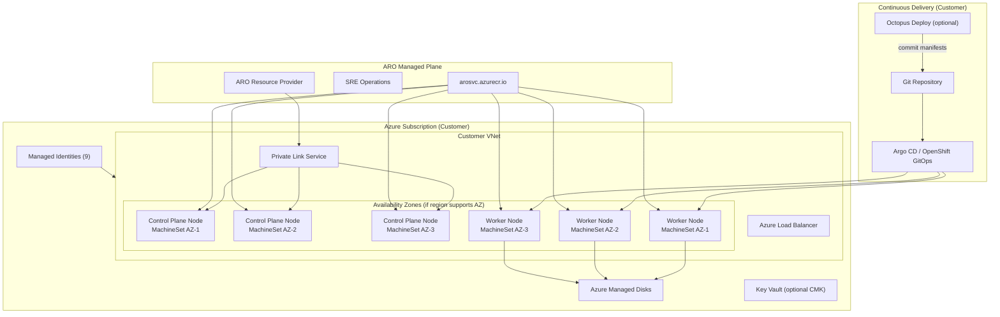
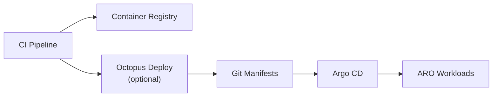

# Azure Red Hat OpenShift Production Decision Matrix

**Pre-Deployment Decisions & Production Readiness Checklist**

---

## Table of Contents

- [Introduction](#introduction)
- [How to Use This Matrix](#how-to-use-this-matrix)
- [Architectural Overview](#architectural-overview)
- [Decision Matrix](#decision-matrix)
  - [1. Business & Compliance](#1-business--compliance)
  - [2. Region, Zone & Capacity](#2-region-zone--capacity)
  - [3. Cluster Sizing & Instance Types](#3-cluster-sizing--instance-types)
  - [4. Identity & Access](#4-identity--access)
  - [5. Network Architecture](#5-network-architecture)
  - [6. Cluster Visibility & Ingress](#6-cluster-visibility--ingress)
  - [7. Egress & Firewall](#7-egress--firewall)
  - [8. Storage](#8-storage)
  - [9. GitOps & Continuous Delivery](#9-gitops--continuous-delivery)
  - [10. Observability & Logging](#10-observability--logging)
  - [11. Security & Compliance](#11-security--compliance)
  - [12. Backup, DR & Lifecycle](#12-backup-dr--lifecycle)
- [Region & SKU Validation Runbook](#region--sku-validation-runbook)
- [Production Readiness Gate](#production-readiness-gate)
- [References](#references)

---

## Introduction

This decision matrix helps architects, platform engineers, and customer teams evaluate design choices **before** deploying Azure Red Hat OpenShift (ARO) to production. Each section presents a decision question, compares options, states a recommendation, and links validation steps.

Use this document together with the [ARO Operations Guide](../aro-operation-guide.md), which covers Day 1 deployment and Day 2 operations in detail.

### Purpose

- Provide a structured Q&A framework for production planning
- Surface decisions that are **irreversible or expensive to change** after cluster creation
- Validate **region, availability zone, and VM SKU constraints** before committing to a design
- Produce an auditable production-readiness checklist for stakeholders

### Who Should Use This Matrix

| Role | Primary Use |
|------|-------------|
| **Cloud Architect** | Region, network, HA, and compliance decisions |
| **Platform Engineer** | Sizing, identity, GitOps, and operational design |
| **Security / GRC** | Data residency, encryption, egress, and access controls |
| **Release / DevOps** | CD toolchain (Argo CD, Octopus Deploy) integration |
| **Customer Sponsor** | Sign-off on production-readiness gate |

### Document Conventions

| Convention | Meaning |
|------------|---------|
| **Q:** | Decision question to answer with your team |
| **A:** | Recommended answer for production workloads |
| - [ ] Checkbox | Validation or sign-off item |
| **IMPORTANT** | Decision with high blast radius if wrong |
| ⚠️ Warning | Common pitfall or support-policy constraint |
| 🔒 Irreversible | Cannot be changed (or only via support) after install |

---

## How to Use This Matrix

1. **Work top to bottom** — later decisions depend on earlier ones (region before SKU, network before egress).
2. **Record answers** in the [Production Readiness Checklist](./production-readiness-checklist.md).
3. **Run the validation runbook** in [Region & SKU Validation Runbook](#region--sku-validation-runbook) before any cluster create.
4. **Gate production traffic** only after the [Production Readiness Gate](#production-readiness-gate) is complete.

**Estimated planning time:** 2–4 hours for a first production cluster; add time for regulated environments.

---

## Architectural Overview

ARO is a jointly managed OpenShift service. Microsoft and Red Hat operate the control plane; customer workloads run on worker nodes in your Azure subscription.



### Key Architectural Facts

| Fact | Implication |
|------|-------------|
| 3 control plane nodes (fixed) | Sized at install; horizontal scaling not supported |
| 3+ worker nodes minimum | Production HA requires ≥3 workers in AZ regions |
| AZ-aware by default | In AZ regions, ARO spreads control plane and workers across zones automatically |
| PVs are zone-scoped | Persistent volumes bind to the zone where provisioned |
| Managed resource group | ARO RP owns cluster VMs; do not modify or deallocate them |
| Private Link to API | SRE access uses Private Link; do not remove |

---

## Decision Matrix

### 1. Business & Compliance

#### Q1: What is the target environment classification?

| Option | Description | Production Fit |
|--------|-------------|----------------|
| **Sandbox / Dev** | Public API, minimal controls, cost-optimized | ❌ Not for production |
| **Non-Production** | Private cluster, standard controls, smaller SKUs | ⚠️ Staging / pre-prod only |
| **Production** | Private cluster, HA, monitoring, backup, IdP | ✅ Target state |
| **Regulated** | Production + CMK, restricted egress, audit logging | ✅ With additional controls |

**A:** Classify the cluster explicitly. Production and regulated workloads require **private visibility**, **managed identity**, and full observability.

- [ ] Environment classification documented and approved
- [ ] Data residency / sovereignty requirements identified
- [ ] RPO/RTO targets defined

#### Q2: Is data residency restricted to specific Azure regions?

| Option | When to Choose |
|--------|----------------|
| **Single mandated region** | Legal, contractual, or latency requirements |
| **Primary + DR region pair** | Business continuity requirement |
| **Flexible** | Choose region with best ARO SKU availability |

**A:** If a region is mandated, run the [Region & SKU Validation Runbook](#region--sku-validation-runbook) **in that exact region** before architecture sign-off. Supported ARO region ≠ guaranteed SKU capacity.

- [ ] Mandated region(s) documented
- [ ] ARO supported in region (`az provider show`)
- [ ] SKU capacity validated (not just quota)

---

### 2. Region, Zone & Capacity

**IMPORTANT:** Region and availability zone decisions affect HA, storage affinity, latency, and whether your chosen VM SKUs can actually be allocated.

#### Q3: Which Azure region will host the cluster?

| Consideration | Guidance |
|---------------|----------|
| **ARO support** | Region must appear in `Microsoft.RedHatOpenShift` provider locations |
| **OpenShift version** | Run `az aro get-versions --location <region>` |
| **SKU capacity** | `SkuNotAvailable` can occur even with sufficient quota |
| **Latency** | Place near users, dependent Azure PaaS, and CI/CD systems |
| **DR pairing** | Document paired region if required |

**A:** Select a region that is ARO-supported, meets residency requirements, and passes SKU pre-validation for your master and worker VM sizes.

```bash
# List ARO-supported regions
az provider show -n Microsoft.RedHatOpenShift \
  --query "resourceTypes[?resourceType=='OpenShiftClusters'].locations" -o tsv

# List OpenShift versions available in the target region
az aro get-versions --location <region>
```

- [ ] Region is in ARO provider locations list
- [ ] Target OpenShift version available in region
- [ ] Region approved by security / compliance

#### Q4: Does the region support Azure Availability Zones, and do you require zone redundancy?

| Scenario | ARO Behavior |
|----------|--------------|
| **Region with AZ** | Control plane and workers spread across zones automatically (one MachineSet per zone) |
| **Region without AZ** | Single MachineSet; nodes in one fault domain |
| **Infrastructure nodes** | If used, deploy 3 nodes (one per AZ) for SLA alignment |

**A:** For production, prefer a region with **Availability Zones**. ARO handles zone distribution automatically — you do not select zones manually at install time.

```bash
# Check if region supports Availability Zones
az account list-locations --query "[?name=='<region>'].availabilityZoneMappings" -o json
```

See also: [Azure regions with Availability Zones](https://learn.microsoft.com/en-us/azure/reliability/availability-zones-region-support)

- [ ] AZ support confirmed for target region
- [ ] Stakeholders understand PVs are zone-bound
- [ ] DR strategy accounts for zone vs regional failure

#### Q5: Do you have sufficient vCPU quota **and** physical SKU capacity?

| Check | What It Validates |
|-------|-------------------|
| **Subscription quota** | Your entitlement to VM family vCPUs |
| **SKU availability** | Azure can allocate the specific VM size right now |
| **Burst capacity** | Room for control plane scale-up (2× control plane vCPU headroom) |

⚠️ **Common failure:** `SkuNotAvailable` in a supported region with adequate quota — caused by regional physical capacity, especially when ARO allocates multiple VMs simultaneously.

**A:** Validate **both** quota and SKU availability. Request quota increases early. Keep **2× control plane vCPU** as spare capacity per support policy.

```bash
LOCATION=<region>
MASTER_SKU=Standard_D16s_v5   # example
WORKER_SKU=Standard_D8s_v5    # example
MASTER_COUNT=3
WORKER_COUNT=6

# Quota check (example: Dsv5 family)
az vm list-usage --location $LOCATION \
  --query "[?contains(name.value, 'standardDSv5Family')]" -o table

# SKU availability in region (filter to your sizes)
az vm list-skus --location $LOCATION --size $MASTER_SKU --all -o table
az vm list-skus --location $LOCATION --size $WORKER_SKU --all -o table

# Minimum vCPU for initial cluster (masters + workers)
MASTER_VCPU=16   # adjust per SKU
WORKER_VCPU=8    # adjust per SKU
echo "Minimum vCPU needed: $(( MASTER_COUNT * MASTER_VCPU + WORKER_COUNT * WORKER_VCPU ))"
```

- [ ] Quota ≥ minimum vCPU (40+ cores; 60+ recommended)
- [ ] Quota ≥ 2× control plane vCPU headroom
- [ ] Master and worker SKUs return available in `az vm list-skus`
- [ ] Fallback SKU family identified if primary SKU unavailable

---

### 3. Cluster Sizing & Instance Types

#### Q6: Which control plane (master) VM size?

| Scenario | VM Size | vCPU | Memory | Notes |
|----------|---------|------|--------|-------|
| **Minimum** | Standard_D8s_v5 | 8 | 32 GB | Supported floor |
| **Production** | Standard_D16s_v5 | 16 | 64 GB | Recommended default |
| **Large scale** | Standard_D32s_v5 | 32 | 128 GB | High API/etcd load |

🔒 **Irreversible:** Master count is always 3. Size chosen at install; resize only via support.

**A:** Production clusters should start at **Standard_D16s_v5** unless workload profiling proves D8s_v5 is sufficient.

- [ ] Master SKU is in [ARO supported control plane list](https://learn.microsoft.com/en-us/azure/openshift/support-policies-v4)
- [ ] Master SKU available in target region
- [ ] OpenShift version supports SKU (Dsv6 requires 4.19+)

#### Q7: Which worker VM size and count?

| Workload Profile | Example SKU | Min Workers (Prod) |
|------------------|-------------|-------------------|
| **General purpose** | Standard_D8s_v5 | 3 (6+ recommended) |
| **Memory intensive** | Standard_E8s_v5 | 3+ |
| **Compute intensive** | Standard_F8s_v2 | 3+ |
| **GPU** | NC-series | Dedicated MachineSet |

**A:** Minimum 3 workers for production. Size for peak workload + cluster services overhead. Use multiple MachineSets for mixed workloads.

- [ ] Worker SKU in ARO supported worker list
- [ ] Worker SKU available in target region
- [ ] Autoscaling strategy defined (MachineSet / Cluster Autoscaler)
- [ ] Node count ≤ 250 (cluster maximum)

#### Q8: Will you use infrastructure nodes?

| Option | Use When |
|--------|----------|
| **No** | Smaller clusters; ingress/logging on workers |
| **Yes (3 nodes, 1/AZ)** | Isolate ingress, registry, monitoring from app workloads |

**A:** For production at scale, deploy **3 infrastructure nodes** (one per AZ) and do not schedule application workloads on them.

- [ ] Infrastructure node requirement evaluated
- [ ] If yes: 3 nodes planned across AZs

#### Q9: Version-specific SKU constraints

| SKU Family | Minimum ARO Version |
|------------|---------------------|
| Dsv6 / Ddsv6 | 4.19+ |
| FXmds_v2 (day-2 worker only) | 4.20+ |

**A:** Align OpenShift version with desired SKU generation before finalizing hardware design.

- [ ] OpenShift version supports all chosen SKUs
- [ ] Version within [support lifecycle](https://learn.microsoft.com/en-us/azure/openshift/support-lifecycle)

---

### 4. Identity & Access

#### Q10: Managed Identity or Service Principal?

| Factor | Managed Identity ✅ | Service Principal |
|--------|---------------------|-------------------|
| Credential lifecycle | Automatic | Manual rotation |
| Least privilege | ARO built-in roles | Broad Contributor |
| Production fit | Recommended | Legacy only |

🔒 **Irreversible:** Identity model selected at cluster creation.

**A:** **Managed Identity** with 9 user-assigned identities and ARO built-in roles for all production clusters.

- [ ] 9 managed identities pre-created
- [ ] ARO built-in roles assigned per [MI guide](https://cloud.redhat.com/experts/aro/miwi/)
- [ ] Azure AD / Entra ID integration planned for human access
- [ ] kubeadmin disable plan documented (after IdP validation)

---

### 5. Network Architecture

#### Q11: Single VNet or Hub-Spoke?

| Topology | Best For |
|----------|----------|
| **Single VNet** | Dev/test, small teams |
| **Hub-Spoke** | Production, shared firewall/DNS/VPN |

**A:** Production enterprise deployments should use **Hub-Spoke** with centralized egress inspection.

- [ ] VNet CIDR does not overlap existing networks
- [ ] Master subnet ≥ /27 (recommended /26)
- [ ] Worker subnet ≥ /27 (recommended /24 for scale)
- [ ] Service endpoint: `Microsoft.ContainerRegistry` on both subnets

#### Q12: ARO-managed NSG or Bring Your Own NSG (BYO)?

| Option | Recommendation |
|--------|----------------|
| **ARO-managed NSG** | Default for most production clusters |
| **BYO NSG** | Only when policy mandates pre-created NSGs |

**A:** Use **ARO-managed NSG** unless compliance requires BYO.

- [ ] NSG model selected and documented
- [ ] If BYO: required rules validated per [BYO NSG guide](https://learn.microsoft.com/en-us/azure/openshift/howto-bring-nsg)

---

### 6. Cluster Visibility & Ingress

#### Q13: Private or public cluster?

| Visibility | API | Ingress | Production Fit |
|------------|-----|---------|----------------|
| **Private** | Private IP | Private IP | ✅ Required |
| **Public** | Public IP | Public IP | ❌ Dev/test only |

🔒 **Irreversible:** Cluster visibility cannot be changed after creation.

**A:** **Private cluster** for all production workloads.

- [ ] Private visibility selected
- [ ] Admin access path defined (VPN / ExpressRoute / Bastion)
- [ ] Application exposure path defined (Front Door / App Gateway / internal)

#### Q14: Default `*.aroapp.io` or custom domain?

| Option | Use Case |
|--------|----------|
| **Default domain** | Non-prod, pilots |
| **Custom domain** | Production branded URLs |

**A:** Production should use a **custom domain** with enterprise TLS and DNS control.

- [ ] Domain ownership confirmed
- [ ] DNS A records plan for API and `*.apps`
- [ ] Certificate strategy defined (cert-manager / Key Vault / corporate CA)

---

### 7. Egress & Firewall

#### Q15: What outbound connectivity model?

| Model | Description | Production Fit |
|-------|-------------|----------------|
| **LoadBalancer (default)** | Public egress via LB | Simple non-prod |
| **UserDefinedRouting (UDR)** | Egress via firewall/NVA | ✅ Enterprise production |
| **Egress Lockdown** | ARO proxies required endpoints | Restricted environments |

**A:** Production uses **UDR** through Azure Firewall or NVA, or **Egress Lockdown** where direct internet egress is prohibited.

- [ ] Outbound type selected
- [ ] Required endpoints allowlisted (if not using Egress Lockdown)
- [ ] Egress IP requirements per namespace evaluated

See: [Egress Lockdown concepts](https://learn.microsoft.com/en-us/azure/openshift/concepts-egress-lockdown), [Restrict egress](https://learn.microsoft.com/en-us/azure/openshift/howto-restrict-egress)

---

### 8. Storage

#### Q16: What storage classes and performance tiers?

| Workload | Storage Class | Notes |
|----------|---------------|-------|
| Block (RWO) | `managed-premium` | Databases, stateful apps |
| Shared (RWX) | `azurefile-csi` | Shared config/content |
| Encryption | Platform default or CMK | Regulated workloads |

**A:** Map each stateful workload to a storage class before go-live. Remember **PVs are zone-scoped**.

- [ ] Stateful workload inventory complete
- [ ] Storage class per workload documented
- [ ] CMK decision made ([BYOK guide](https://learn.microsoft.com/en-us/azure/openshift/howto-byok))
- [ ] Backup tool selected (OADP / Velero)

---

### 9. GitOps & Continuous Delivery

#### Q17: What is your deployment model?

| Model | Components | Best For |
|-------|------------|----------|
| **GitOps only** | OpenShift GitOps (Argo CD) | Platform-native CD |
| **Hybrid CD** | Octopus Deploy + Argo CD | Enterprise approvals + GitOps reconcile |
| **CI-driven kubectl** | Pipelines apply manifests | ❌ Not recommended for production |

**A:** Production should use **GitOps** (OpenShift GitOps operator). Teams with release gates can add **Octopus Deploy** to orchestrate Git commits while Argo CD reconciles cluster state.



- [ ] GitOps operator installation planned
- [ ] Git repo structure and branch strategy defined
- [ ] If Octopus: gateway outbound connectivity from ARO validated
- [ ] Secrets management for Git credentials defined

See: [OpenShift GitOps operator](https://docs.openshift.com/container-platform/latest/operators/operator-gitops.html), [Octopus Argo CD docs](https://octopus.com/docs/argo-cd)

---

### 10. Observability & Logging

#### Q18: What monitoring and logging stack?

| Capability | Production Requirement |
|------------|------------------------|
| **Platform monitoring** | Default Prometheus (do not remove) |
| **User workload monitoring** | Enable via ConfigMap |
| **Cluster logging** | Cluster Logging Operator / Forwarder |
| **Azure integration** | Azure Monitor / Log Analytics (optional) |
| **Alerting** | Route to on-call (PagerDuty, Teams, etc.) |

**A:** Enable **user workload monitoring**, deploy **cluster logging**, and forward to your SIEM or Azure Monitor.

- [ ] User workload monitoring enabled
- [ ] Log forwarding destination configured
- [ ] API audit logging policy set
- [ ] Prometheus retention ≥ 7 days (support policy)

---

### 11. Security & Compliance

#### Q19: What security controls are required?

| Control | Production Default |
|---------|-------------------|
| **Private cluster** | Yes |
| **Managed Identity** | Yes |
| **Azure AD integration** | Yes |
| **Network policies** | Enable for multi-tenant namespaces |
| **Pod Security** | Restricted / baseline per namespace policy |
| **Image scanning** | Integrate with registry scanning |
| **CMK** | If regulatory requirement |

- [ ] Threat model documented
- [ ] RBAC roles mapped (cluster-admin minimized)
- [ ] Azure Policy assignments reviewed
- [ ] Tagging strategy defined ([ARO tagging guide](https://learn.microsoft.com/en-us/azure/openshift/howto-tag-resources))

---

### 12. Backup, DR & Lifecycle

#### Q20: What is your DR strategy?

| Strategy | RPO/RTO | Complexity |
|----------|---------|------------|
| **Backup/Restore** | Hours | Medium |
| **Active/Passive** | Minutes–hours | High |
| **Active/Active** | Near-zero | Very high |

**A:** At minimum, implement **OADP backup** for PVs and **GitOps** for configuration. Document RPO/RTO and test restore quarterly. For a full cross-region strategy comparison (Pilot Light, Active/Passive, Active/Active) and a dedicated DR readiness checklist, see the [ARO Disaster Recovery Strategy guide](../aro-disaster-recovery/README.md).

- [ ] Backup solution deployed (OADP)
- [ ] DR region identified (if required)
- [ ] Upgrade cadence defined (quarterly recommended)
- [ ] Support contacts documented (Microsoft + Red Hat)

---

## Region & SKU Validation Runbook

Execute this runbook **before** final architecture approval. Replace variables and attach output to your readiness checklist.

```bash
#!/usr/bin/env bash
# ARO pre-flight: region, zone, and SKU validation
set -euo pipefail

LOCATION="${LOCATION:-eastus}"
OPENSHIFT_VERSION="${OPENSHIFT_VERSION:-}"   # e.g. 4.20.12
MASTER_SKU="${MASTER_SKU:-Standard_D16s_v5}"
WORKER_SKU="${WORKER_SKU:-Standard_D8s_v5}"
WORKER_COUNT="${WORKER_COUNT:-6}"

echo "=== 1. ARO region support ==="
az provider show -n Microsoft.RedHatOpenShift \
  --query "resourceTypes[?resourceType=='OpenShiftClusters'].locations" -o tsv \
  | tr ',' '\n' | grep -Fx "$LOCATION" \
  && echo "PASS: $LOCATION is ARO-supported" \
  || echo "FAIL: $LOCATION not in ARO provider locations"

echo "=== 2. OpenShift versions in region ==="
az aro get-versions --location "$LOCATION" -o table

if [[ -n "$OPENSHIFT_VERSION" ]]; then
  az aro get-versions --location "$LOCATION" -o tsv | grep -Fx "$OPENSHIFT_VERSION" \
    && echo "PASS: version $OPENSHIFT_VERSION available" \
    || echo "FAIL: version $OPENSHIFT_VERSION not available in $LOCATION"
fi

echo "=== 3. Availability Zones ==="
az account list-locations \
  --query "[?name=='$LOCATION'].{Region:name, AZ:availabilityZoneMappings}" -o json

echo "=== 4. SKU availability ==="
for SKU in "$MASTER_SKU" "$WORKER_SKU"; do
  echo "--- $SKU ---"
  if az vm list-skus --location "$LOCATION" --size "$SKU" --all -o table | grep -q "$SKU"; then
    echo "PASS: $SKU found in $LOCATION"
  else
    echo "FAIL: $SKU NOT available in $LOCATION"
  fi
done

echo "=== 5. Quota sample (Dsv5 family) ==="
az vm list-usage --location "$LOCATION" \
  --query "[?contains(name.value, 'standardDSv5Family')]" -o table

echo "=== 6. Estimated minimum vCPU ==="
echo "Masters: 3 x $MASTER_SKU"
echo "Workers: $WORKER_COUNT x $WORKER_SKU"
echo "Action: ensure quota covers initial + 2x control-plane headroom"
```

### SKU / Region Decision Quick Reference

| Symptom | Likely Cause | Action |
|---------|--------------|--------|
| `SkuNotAvailable` | Regional capacity, not quota | Try alternate SKU in same family; try paired region; open Azure support ticket |
| Region not in provider list | ARO not offered | Choose supported region |
| Version not in `get-versions` | Version not published to region | Pick available version or different region |
| AZ empty in location query | Region has no AZ | Accept single fault domain; plan DR at region level |
| PV attach fails cross-zone | Zone-bound disk | Schedule pod in same zone as PV |

---

## Production Readiness Gate

A cluster is **production-ready** when all gates pass. Use the detailed checklist in [production-readiness-checklist.md](./production-readiness-checklist.md).

| Gate | Owner | Status |
|------|-------|--------|
| **G1: Design** | Architect | All matrix questions answered |
| **G2: Capacity** | Platform Eng | Region/zone/SKU runbook passed |
| **G3: Security** | Security | Private cluster, MI, IdP, network policies |
| **G4: Operations** | SRE | Monitoring, logging, backup, runbooks |
| **G5: CD** | DevOps | GitOps (± Octopus) validated end-to-end |
| **G6: Sign-off** | Sponsor | Checklist approved |

**Minimum production criteria (non-negotiable):**

- [ ] Private cluster in AZ-capable region (or documented exception)
- [ ] Managed Identity with correct role assignments
- [ ] SKU capacity validated (not quota-only)
- [ ] ≥3 workers, production-sized masters (D16s_v5+)
- [ ] Hub-spoke or equivalent network controls
- [ ] Azure AD admin access; kubeadmin disabled
- [ ] Monitoring + logging + backup operational
- [ ] GitOps pipeline proven with rollback test
- [ ] Support policy constraints reviewed

---

## References

All links verified HTTP 200 at document publication time.

### Azure Red Hat OpenShift

- [ARO introduction](https://learn.microsoft.com/en-us/azure/openshift/intro-openshift)
- [ARO FAQ (regions, zones, VM sizes)](https://learn.microsoft.com/en-us/azure/openshift/openshift-faq)
- [ARO service definitions](https://learn.microsoft.com/en-us/azure/openshift/openshift-service-definitions)
- [ARO support policy v4 (VM sizes, cluster limits)](https://learn.microsoft.com/en-us/azure/openshift/support-policies-v4)
- [ARO support lifecycle](https://learn.microsoft.com/en-us/azure/openshift/support-lifecycle)
- [Create an ARO cluster](https://learn.microsoft.com/en-us/azure/openshift/howto-create-openshift-cluster)
- [Create a private cluster](https://learn.microsoft.com/en-us/azure/openshift/howto-create-private-cluster)
- [Managed identities](https://learn.microsoft.com/en-us/azure/openshift/howto-understand-managed-identities)
- [Red Hat MI walkthrough](https://cloud.redhat.com/experts/aro/miwi/)
- [BYO NSG](https://learn.microsoft.com/en-us/azure/openshift/howto-bring-nsg)
- [Egress Lockdown concepts](https://learn.microsoft.com/en-us/azure/openshift/concepts-egress-lockdown)
- [Restrict egress](https://learn.microsoft.com/en-us/azure/openshift/howto-restrict-egress)
- [Cluster-wide proxy](https://learn.microsoft.com/en-us/azure/openshift/cluster-wide-proxy-configure)
- [Customer-managed keys (BYOK)](https://learn.microsoft.com/en-us/azure/openshift/howto-byok)
- [Infrastructure nodes](https://learn.microsoft.com/en-us/azure/openshift/howto-infrastructure-nodes)
- [Resource tagging](https://learn.microsoft.com/en-us/azure/openshift/howto-tag-resources)
- [Configure Azure AD](https://learn.microsoft.com/en-us/azure/openshift/configure-azure-ad-ui)
- [ARO Landing Zone Accelerator](https://learn.microsoft.com/en-us/azure/cloud-adoption-framework/scenarios/app-platform/azure-red-hat-openshift/landing-zone-accelerator)
- [ARO Terraform examples](https://github.com/rh-mobb/terraform-aro)
- [Terraform azurerm ARO resource](https://registry.terraform.io/providers/hashicorp/azurerm/latest/docs/resources/redhat_openshift_cluster)
- [ARO Resource Provider (GitHub)](https://github.com/Azure/ARO-RP)

### Azure Platform

- [Availability Zones overview](https://learn.microsoft.com/en-us/azure/reliability/availability-zones-overview)
- [Regions with Availability Zones](https://learn.microsoft.com/en-us/azure/reliability/availability-zones-region-support)
- [VM sizes](https://learn.microsoft.com/en-us/azure/virtual-machines/sizes)
- [General purpose VM sizes](https://learn.microsoft.com/en-us/azure/virtual-machines/sizes-general)
- [VM availability and SLA](https://learn.microsoft.com/en-us/azure/virtual-machines/availability)

### OpenShift & GitOps

- [OpenShift documentation](https://docs.openshift.com/container-platform/latest/welcome/index.html)
- [OpenShift GitOps operator](https://docs.openshift.com/container-platform/latest/operators/operator-gitops.html)
- [Cluster logging deployment](https://docs.openshift.com/container-platform/latest/logging/cluster-logging-deploying.html)
- [User workload monitoring](https://docs.openshift.com/container-platform/latest/monitoring/enabling-monitoring-for-user-defined-projects.html)
- [Ingress certificate replacement](https://docs.openshift.com/container-platform/latest/security/certificates/replacing-default-ingress-certificate.html)
- [OVN-Kubernetes egress IPs](https://docs.redhat.com/en/documentation/openshift_container_platform/4.20/html/ovn-kubernetes_network_plugin/configuring-egress-ips-ovn)
- [Red Hat OpenShift GitOps documentation](https://docs.redhat.com/en/documentation/red_hat_openshift_gitops/latest)
- [Argo CD documentation](https://argo-cd.readthedocs.io/en/stable/)

### Octopus Deploy + Argo CD

- [Octopus Argo CD overview](https://octopus.com/docs/argo-cd)
- [Argo CD instances and gateway](https://octopus.com/docs/argo-cd/instances)
- [Scoping annotations](https://octopus.com/docs/argo-cd/annotations)
- [Argo CD deployment steps](https://octopus.com/docs/argo-cd/steps)
- [GitOps with Octopus and Argo CD (blog)](https://octopus.com/blog/argocd-and-octopus)

### Red Hat

- [Red Hat pull secret](https://console.redhat.com/openshift/install/pull-secret)
- [Red Hat support portal](https://access.redhat.com/)
- [Red Hat ARO experts content](https://cloud.redhat.com/experts/tags/aro/)
- [Cluster logging to Azure Monitor](https://cloud.redhat.com/experts/aro/clf-to-azure/)

### Related Guides in This Repository

- [ARO Operations Guide](../aro-operation-guide.md)
- [ARO Disaster Recovery Strategy & Readiness Checklist](../aro-disaster-recovery/README.md)
- [Octopus + Argo CD on ARO](../../openshift-demos/octopus-argocd-aro-integration/README.md)
- [ARO Network Troubleshooting](../network-troubleshooting/ARO/ARO_Network_Troubleshooting_Guide.md)
