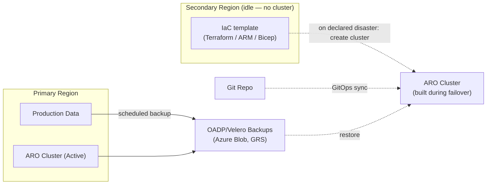
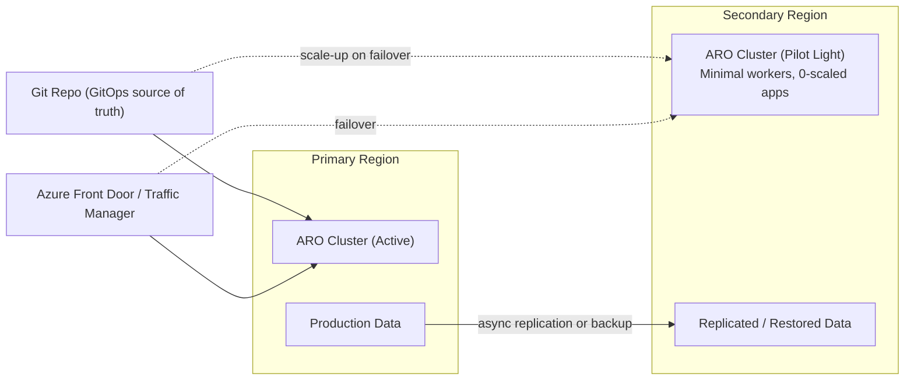
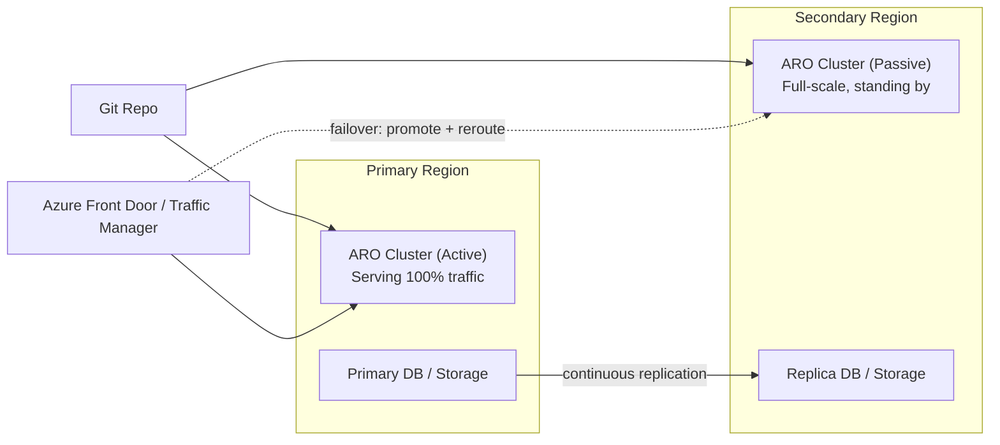
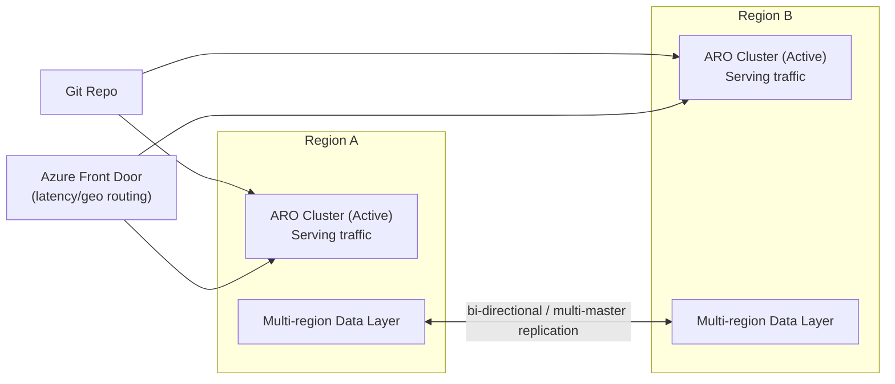

# Azure Red Hat OpenShift Disaster Recovery Strategy & Readiness Checklist

**Executive Briefing — Multi-Region Business Continuity for ARO**

This guide is written for a management audience evaluating disaster recovery (DR) investment for Azure Red Hat OpenShift (ARO). It defines RTO/RPO in business terms, compares cross-region DR architectures with cost and complexity trade-offs, and provides an operational checklist to validate DR readiness.

> **Key platform fact:** an ARO cluster's control plane is a **regional resource** — it cannot span two Azure regions. Every DR strategy below therefore relies on **two or more independent ARO clusters** (one per region) kept in sync through data replication, GitOps, and traffic steering — not a single "stretched" cluster.

---

## Table of Contents

- [Core Concepts: RTO and RPO for ARO Workloads](#core-concepts-rto-and-rpo-for-aro-workloads)
- [Regional DR Options](#regional-dr-options)
- [Strategy Comparison](#strategy-comparison)
- [Readiness Checklist](#readiness-checklist)
- [Executive Summary](#executive-summary)
- [References](#references)

---

## Core Concepts: RTO and RPO for ARO Workloads

### What "Disaster Recovery" Actually Covers

DR is an umbrella term, not a single feature. Per [Red Hat's ARO DR guidance](https://cloud.redhat.com/experts/aro/disaster-recovery/), it breaks into four distinct capabilities — and a plan that only covers the first one is not a DR plan:

| Capability | What It Means | Commonly Overlooked Because |
|---|---|---|
| **Backup (and restore)** | Point-in-time copies of app state, PVs, and backing services that can be replayed | Teams test backup, rarely test *restore* |
| **Failover (and failback)** | Cutting traffic/data to the DR region — and just as importantly, cutting **back** to primary once it recovers | Failback is almost never rehearsed; it's where the longest real outages happen |
| **High Availability** | Redundancy that avoids downtime for *component*-level failures (AZ, node, pod) without ever invoking DR | Confused with DR — HA prevents small failures, DR recovers from regional ones |
| **Disaster Avoidance** | Proactively moving workloads out of a region **before** a predicted disruption (e.g., a tracked weather event, planned maintenance) | Requires the same tooling as failover, so it's often not planned for separately |

The most important word in "Disaster Recovery" is **Recovery** — every strategy below must be periodically *tested*, including the failback path, not just designed.

> **Shared responsibility — what Red Hat/Microsoft back up vs. what you back up:** ARO is a jointly managed service — Microsoft and Red Hat SRE own and back up the **control plane (etcd, API server)** as part of the managed service; customers do not have node/etcd access and do not run `cluster-backup.sh` themselves (that guidance applies to *self-managed* OpenShift, not ARO). Your DR responsibility is everything above the control plane: **application state, persistent data, and configuration (Git)**. This is exactly what OADP/Velero and GitOps cover in this guide, and it's why they — not etcd snapshots — are the center of an ARO DR plan.

### Business Impact Analysis: Set Targets by Criticality Tier, Not Platform-Wide

Per the [Azure Well-Architected Framework's DR guidance](https://learn.microsoft.com/en-us/azure/well-architected/design-guides/disaster-recovery), RTO/RPO targets are a **business decision derived from a Business Impact Analysis (BIA)**, not a platform default. Before choosing a strategy from the next section, classify each application into a criticality tier:

| Tier | Example Workloads | Target RTO | Target RPO | Typical Strategy |
|---|---|---|---|---|
| **Tier 0 — Mission Critical** | Checkout, payments, patient safety systems | Seconds–minutes | Near-zero | Active/Active |
| **Tier 1 — Business Critical** | Core customer-facing apps, order management | Minutes–1 hr | Minutes | Active/Passive |
| **Tier 2 — Business Operational** | Internal line-of-business apps, reporting | Hours | Hours | Pilot Light |
| **Tier 3 — Standard / Non-Critical** | Dev tooling, internal dashboards, batch jobs | Same day | 24 hrs | Backup & Restore |

**A:** Run this classification as a workshop with business stakeholders (not just engineering) before architecture discussions start. **Over-engineering Tier 3 workloads is the most common source of wasted DR spend** — a single platform-wide "near-zero RTO/RPO" target, applied uniformly, is usually driven by not having done this exercise.

Every DR conversation also reduces to two numbers. Management should approve **targets** for both, per application tier, before any architecture is chosen — the targets determine the cost.

### Recovery Time Objective (RTO)

**Plain-language definition:** *How long can the business tolerate the application being down?*

RTO is the maximum acceptable **elapsed time** from the moment a region fails to the moment the application is back up and serving users from the DR region.

| In ARO terms, RTO must cover | Because |
|---|---|
| Detecting the regional outage | Automated health checks vs. manual escalation both take time |
| Provisioning or scaling the DR cluster | A cold cluster must be built (~40–60 min); a warm one just scales workers |
| Restoring data (from backup or promoting a replica) | Restore/replay time grows with data volume |
| Re-pointing GitOps to deploy the last-known-good manifests | Argo CD sync time for the application set |
| Redirecting traffic (DNS/Front Door cutover + TTL/propagation) | Global DNS propagation and health-probe intervals add minutes |
| Application warm-up (caches, connection pools, JIT) | Cold starts are slower than steady state |

### Recovery Point Objective (RPO)

**Plain-language definition:** *How much data can the business afford to lose?*

RPO is measured backward in time from the failure: if RPO is 15 minutes, the business accepts losing up to 15 minutes of the most recent transactions (orders, updates, uploads) that had not yet replicated to the DR region.

| In ARO terms, RPO is set by | Example |
|---|---|
| Backup/snapshot frequency (OADP/Velero) | Nightly backup → up to 24h of data loss |
| Storage/database replication lag | Async streaming replication → seconds to minutes of lag |
| GitOps commit frequency | Config drift not yet pushed to Git is *not* covered by RPO — it's a change-management gap |
| Message queue / event log durability | Undelivered events at time of failure may be lost unless durably replicated |

### Why This Matters to the Business

| Concept | Business Question It Answers | Cost Relationship |
|---|---|---|
| **RTO** | "How long is checkout/ordering/support offline?" | Lower RTO → more standby infrastructure running 24/7 |
| **RPO** | "How much data (orders, transactions, records) do we permanently lose?" | Lower RPO → more continuous, expensive replication |

**Rule of thumb:** RTO and RPO targets should be set **per workload tier** (Tier 1 revenue-critical vs. Tier 3 internal tools), not as one number for the whole platform — a single "near-zero RTO/RPO for everything" target is usually the single biggest driver of unnecessary DR cost.

---

## Regional DR Options

All strategies assume: a **primary ARO cluster**, a **secondary ARO cluster in a paired/alternate Azure region**, a **Git repository as the single source of truth** (GitOps), and an **OADP/Velero backup baseline** underneath all of them — even Active/Active needs point-in-time backups to recover from logical corruption or ransomware, which replication alone will happily replicate into the DR copy too.

Before picking a region pair, confirm both regions are [ARO-supported](https://learn.microsoft.com/en-us/azure/openshift/openshift-faq) with the required SKUs (see the [Decision Matrix](../aro-decision-matrix/README.md#2-region-zone--capacity)) and — where possible — use [Azure paired regions](https://learn.microsoft.com/en-us/azure/reliability/cross-region-replication-azure) to benefit from Microsoft's sequenced-update and platform-recovery ordering, connected via **global VNet peering** (or hub-spoke with ExpressRoute) for cluster-to-cluster and replication traffic.

### DR Tier Terminology — Two Naming Conventions

Executives and engineers sometimes use different vocabulary for the same tiers. Both are used in the industry and in Red Hat's own ARO guidance — this table lets you translate between them:

| Common Name | Red Hat "Hot/Warm/Cold" Term | Cluster in DR Region |
|---|---|---|
| **Backup & Restore** | Hot / **Cold** | Not running — created on-demand from IaC during the failover event |
| **Pilot Light** | Hot / **Warm** (minimal) | Always running, minimally sized, workloads scaled to 0 |
| **Active/Passive** | Hot / **Warm** (full-size) | Always running, fully sized, workloads deployed but idle (no traffic) |
| **Active/Active** | **Hot / Hot** | Always running, fully sized, workloads actively serving traffic |

### 1. Backup & Restore (Cold Standby / Manual Cutover)

No cluster is pre-built in the DR region. On a declared disaster, a new ARO cluster is created from infrastructure-as-code, application manifests are synced via GitOps, and the most recent backup is restored. This is the tier Red Hat recommends starting from — it should be **solid and tested** before investing in anything warmer, since every warmer tier is really "Backup & Restore, plus something to reduce RTO."

**Manual cutover checklist (per Red Hat guidance):** validate the Kubernetes-resource backup restores to a functional app; back up co-located/backing services (e.g., Azure Database for PostgreSQL, Redis) using their native backup tooling; set DNS TTLs low enough to support the cutover; confirm any non-regional SaaS dependencies have their own failover path and any special network access (VPN/firewall allowlist) exists at the DR region too.

### 2. Pilot Light

A minimal-footprint DR cluster is always running in the secondary region — control plane up, core cluster operators healthy, GitOps agent connected — but application workloads are scaled to zero or near-zero. Data is replicated continuously (async) or restored from recent backups. On failover, automation scales up worker capacity and workloads via GitOps, then cuts over traffic.

### 3. Active/Passive (Warm Standby)

The secondary region runs a **full-scale, production-sized** ARO cluster at all times, with workloads deployed (via GitOps) but receiving no live production traffic. Data replicates continuously to the standby's storage/database layer. Failover is a traffic-routing decision plus a data-promotion step (promote replica to primary) — no cluster scale-up is required, which shrinks RTO versus Pilot Light.

### 4. Active/Active

Both regions run production-sized ARO clusters that **both serve live traffic simultaneously**, with global load balancing (Front Door/Traffic Manager, latency- or geo-routing) distributing users across regions. Data layer must support multi-region writes (or a single-writer pattern with active-active reads) — this is the hardest engineering problem in the set, because it requires either conflict-free replicated data types, a globally distributed database (e.g., Cosmos DB multi-region writes), or careful write-partitioning by region.

### ARO-Specific Building Blocks Used Across All Options

| Layer | Tooling |
|---|---|
| Cluster config/app sync | OpenShift GitOps (Argo CD), optionally Red Hat Advanced Cluster Management (RHACM) ApplicationSets for multi-cluster targeting |
| Multi-cluster lifecycle & policy | RHACM (ManagedClusters, Policy propagation, Submariner for cross-cluster networking) |
| PV/application backup & restore | OADP (OpenShift API for Data Protection / Velero) with Azure Blob (GRS) as the backup target |
| Storage-layer replication | Azure NetApp Files Cross-Region Replication; ODF Regional-DR (RamenDR + Ceph/RBD mirroring) where ODF is the storage provider; native database replication (PostgreSQL streaming, Azure SQL geo-replication, Cosmos DB multi-region) |
| Traffic steering / failover | Azure Front Door or Traffic Manager in front of each cluster's ingress (public clusters only — see below for private) |
| DNS | Low-TTL records pointed at Front Door/Traffic Manager, not directly at cluster ingress IPs |
| Container registry | Geo-replicated registry so both regions can pull images without a cross-region dependency |

### Cross-Region Container Registry Replication

Every tier above assumes workloads can be scheduled and pulled in the DR region **without depending on the primary region being up**. Don't overlook the registry:

| Registry | Replication Model | Notes |
|---|---|---|
| **Azure Container Registry (Premium SKU)** | Built-in [geo-replication](https://learn.microsoft.com/en-us/azure/container-registry/container-registry-geo-replication) | Requires **Premium** tier; replication is typically treated as one-way per direction — after a failover, establish replication back from the new primary for the next event |
| **Red Hat Quay** | Repository mirroring / geo-replicated storage backend | Choose based on whether you need active/active or one-way mirroring |

**A:** For Hot/Cold and Hot/Warm tiers, one-way replication into the DR region is sufficient. For **Active/Active**, confirm the registry supports genuinely bidirectional replication, or standardize on push-to-primary-only with replication fanning out to all regions.

### Application Ingress Failover — Public vs. Private Clusters

Front Door and Traffic Manager solve failover cleanly **for public ingress** — but our [production recommendation is a private cluster](../aro-decision-matrix/README.md#6-cluster-visibility--ingress), and private clusters have no public IP for Front Door to route to. Plan for this explicitly:

| Cluster Visibility | Failover Mechanism |
|---|---|
| **Public** | Azure Front Door or Traffic Manager in front of both regions' ingress — automatic health-probe-driven failover |
| **Private** | A custom domain + **internal (private) DNS zone** record that is manually or automatically repointed from the primary cluster's ingress IP to the DR cluster's ingress IP on failover; alternatively, an internal Load Balancer that both clusters register behind, switched via its backend pool |

**A:** For private clusters, provision the custom domain and internal DNS zone as part of initial build — not as a DR afterthought — and rehearse the DNS repoint (not just the cluster/data failover) during every DR drill. This is the step most likely to be forgotten because it's invisible until someone actually needs it.

### Disaster Declaration, Recovery Sequencing & Ransomware Resilience

Three process gaps cause more real-world DR failures than architecture choices do:

| Gap | Best Practice |
|---|---|
| **No clear disaster threshold** | Define, in advance, what conditions authorize a failover (e.g., "primary region API unavailable for >X minutes") and **who** has authority to declare it. An ambiguous "is this really a disaster?" debate during an incident burns RTO. |
| **Unordered recovery** | Recover in dependency order — data stores and backing services *before* the applications that depend on them, and platform services (ingress, DNS, identity) before workloads. A DR runbook without an explicit sequence will improvise one under pressure. |
| **Backups vulnerable to the same disaster that requires them** | Ransomware and logical corruption can propagate into replicas and delete backups if credentials are shared. Use **immutable/WORM storage** or Blob immutability policies for backup targets, and scope backup-automation credentials separately from general admin access. |

**A:** Document disaster-declaration authority and recovery sequencing in the same runbook as the technical failover steps — both are frequently missing even when the technical replication is solid.

---

## Strategy Comparison

| DR Strategy | Target RTO/RPO | Pros | Cons | Cost Impact |
|---|---|---|---|---|
| **Backup & Restore** (Hot/Cold) | RTO: 2–8 hrs · RPO: hours (backup interval) | Cheapest by far — no standing DR compute at all; simplest to explain and audit; good foundation even under warmer tiers | Slowest RTO of all options; cluster build + restore time is hard to compress; first real test of IaC often happens *during* an actual disaster | **Lowest** — pay only for backup storage (Blob GRS) and occasional DR drills |
| **Pilot Light** | RTO: 30–90 min · RPO: 5–60 min | Low standing cost; simple to reason about; DR cluster's small footprint is cheap to keep "warm" | Scale-up step adds latency to RTO; scale-up capacity (SKU/quota) must be pre-validated in DR region or failover can fail at the worst time | **Low–Medium** — pay mostly for control plane + minimal workers + storage replication; app compute scales only on failover |
| **Active/Passive** | RTO: 5–15 min · RPO: seconds–minutes | Much faster RTO — no scale-up needed, just reroute + promote; simpler data model than Active/Active (single writer at a time) | Standby compute runs 24/7 with no revenue-generating traffic — "paying for insurance"; promotion/failback runbooks must be tested regularly to avoid surprises | **Medium–High** — full duplicate compute footprint running continuously, plus continuous replication bandwidth |
| **Active/Active** | RTO: near-zero (seconds, routing-only) · RPO: near-zero to seconds | Best customer experience; no "failover event" for routing — regional loss just reduces capacity; DR capacity is *also* production capacity (no idle spend) | Highest engineering complexity — multi-region writable data layer, conflict resolution, region-aware app design; hardest to test and debug; a bad deployment can now impact both regions | **High** (compute) but **better $/useful-capacity** than Active/Passive since both regions serve live load — no idle standby |

**Reading the table for management:** cost rises from Pilot Light → Active/Active largely as a function of **how much idle capacity you're willing to pay for** to buy back RTO. Active/Active is expensive to build but, unlike Active/Passive, that spend isn't "idle" — it's serving production traffic every day.

---

## Readiness Checklist

Use this checklist to validate that a chosen DR strategy is actually operational, not just architected on paper. Owners and evidence should be recorded before sign-off.

- [ ] **Capacity**
  - [ ] DR region is confirmed ARO-supported (`az provider show`) and hosts the required OpenShift version (`az aro get-versions`)
  - [ ] Master and worker VM SKUs validated as available in the DR region (`az vm list-skus`), not just quota
  - [ ] vCPU quota reserved in the DR region for full failover scale (Active/Passive, Active/Active) or for burst scale-up (Pilot Light)
  - [ ] DR region confirmed to support Availability Zones, or exception documented if not
  - [ ] Autoscaling / MachineSet scale-up procedure tested end-to-end (Pilot Light) with a measured time-to-ready
  - [ ] Infrastructure node capacity mirrored in DR region if used in primary
  - [ ] Cost model for standing DR capacity reviewed and approved by FinOps

- [ ] **Networking**
  - [ ] DR region VNet CIDR planned with no overlap vs. primary region (required for future connectivity/peering)
  - [ ] Global traffic manager (Azure Front Door / Traffic Manager) configured in front of both regions' ingress
  - [ ] DNS TTLs set low enough to support target RTO; records point to Front Door/Traffic Manager, not cluster IPs directly
  - [ ] Health probes configured so failover triggers automatically on real outage, not on transient blips
  - [ ] Private connectivity (VPN/ExpressRoute) extended to DR region for admin and hybrid access
  - [ ] Egress model (UDR/firewall allowlist) replicated in DR region so workloads behave identically post-failover
  - [ ] Global VNet peering (or hub-spoke via ExpressRoute) established between primary and DR region VNets for replication and management traffic
  - [ ] Cross-region network path tested (Submariner, VNet peering, or ExpressRoute) if replication or RHACM requires cluster-to-cluster connectivity
  - [ ] Ingress failover mechanism matches cluster visibility — Front Door/Traffic Manager for public clusters; custom domain + internal DNS zone (or internal LB) for private clusters
  - [ ] Container registry geo-replication configured (ACR Premium geo-replication or Quay mirroring) so image pulls don't depend on the primary region

- [ ] **Stateful Workload & Storage Replication**
  - [ ] Full inventory of stateful workloads with an assigned replication method (native DB replication, ODF Regional-DR, Azure NetApp Files CRR, or backup-only)
  - [ ] Backing PaaS services (Azure Database for PostgreSQL/MySQL, Azure Cache for Redis, Cosmos DB, etc.) have their own native backup or geo-replication enabled — don't assume OADP covers managed PaaS data planes
  - [ ] Application state moved out of container filesystems/pod memory onto replicated storage or PaaS — stateless containers make every tier above cheaper and faster to fail over
  - [ ] Replication lag monitored and alerted against the workload's approved RPO target
  - [ ] OADP/Velero backup schedule configured, targeting geo-redundant (GRS) Azure Blob storage
  - [ ] Backup restore tested into the DR cluster within the last quarter, with restore time recorded
  - [ ] Written storage migration plan exists for moving/re-hydrating data volumes into the DR region's storage classes (not just "replication will handle it")
  - [ ] Data promotion/failback runbook documented and rehearsed (who promotes the replica, in what order, with what verification)
  - [ ] PV zone-affinity accounted for — confirmed DR cluster's storage classes and zone layout match assumptions from primary
  - [ ] Encryption keys (CMK/BYOK) available and accessible in the DR region if used

- [ ] **GitOps / CI/CD Synchronization**
  - [ ] Git repository (source of truth) is itself resilient — hosted with its own HA/DR (e.g., GitHub/GitLab SaaS or self-hosted with backup)
  - [ ] Argo CD / OpenShift GitOps installed and reconciling in the DR cluster, not just the primary
  - [ ] Cluster infrastructure itself is defined as code (Terraform/ARM/Bicep) so the DR (or Backup & Restore tier's) cluster can be recreated without manual click-ops during an actual disaster
  - [ ] RHACM ApplicationSets (or equivalent multi-cluster generator) configured to target both clusters from one manifest set, avoiding config drift; if using RHACM, the hub/management cluster's own availability is accounted for (a 3rd cluster or the primary, with a documented fallback if the hub is the one that's down)
  - [ ] Secrets management (Key Vault / sealed secrets / External Secrets Operator) replicated so the DR cluster can decrypt/sync without manual credential copying
  - [ ] Promotion pipeline (CI → registry → GitOps) validated to be region-agnostic (container images pulled from a geo-replicated registry)
  - [ ] Full failover drill executed at least annually: simulate primary region loss, execute GitOps sync + data promotion + traffic cutover, measure actual RTO/RPO against targets
  - [ ] Rollback/failback path (DR → primary once restored) documented and tested — failback is often skipped in planning and causes the longest real-world outages

- [ ] **Governance & Testing** *(process gaps that fail DR plans as often as technical ones)*
  - [ ] Business Impact Analysis completed; every application assigned a criticality tier with business (not just engineering) sign-off
  - [ ] Disaster-declaration threshold and decision authority documented — who can trigger a regional failover, and under what conditions
  - [ ] Recovery sequencing documented (data/backing services → platform services → applications), not left to improvisation during an incident
  - [ ] Backup storage protected against ransomware/deletion — immutability (WORM) enabled or backup-automation credentials scoped separately from general admin access
  - [ ] Backup job failures and snapshot age vs. RPO SLA monitored and alerted (not discovered during a restore attempt)
  - [ ] Tabletop exercise conducted at least twice a year in addition to the annual full failover drill (cheaper, faster way to validate runbooks and communication paths)
  - [ ] Component-level RTO/RPO tested independently of full DR drills (e.g., time a single database restore, time a single DNS cutover)
  - [ ] Communication plan defined — who notifies customers/stakeholders, through what channel, and on what cadence during a declared disaster
  - [ ] DR runbooks, scripts, and credentials stored somewhere accessible **during** a regional outage (not solely in the primary region)
  - [ ] DR plan reviewed and updated after every drill and after any material architecture change — treated as a living document, not a one-time deliverable

---

## Executive Summary

ARO does not support a single cluster stretched across Azure regions, so DR always means running (or being able to quickly stand up) a second cluster in another region — the only decision is how "warm" to keep it. Backup & Restore is the cheapest, mandatory foundation (hours-scale RTO) that every other tier builds on; Pilot Light is the low-cost warm entry point (30–90 min RTO); Active/Passive buys a fast, low-risk failover (5–15 min RTO) at the cost of idle standby compute; and Active/Active delivers near-zero RTO by turning DR capacity into production capacity at the price of the highest data-architecture complexity. We recommend running a Business Impact Analysis to assign each workload tier to one of these four strategies based on its approved RTO/RPO — not applying one strategy platform-wide — and validating readiness against the attached checklist, including a full failback drill and a documented disaster-declaration process, before any DR plan is considered production-approved.

---

## References

### Azure Red Hat OpenShift & Resiliency

- [ARO — Considerations for Disaster Recovery (Red Hat Cloud Experts)](https://cloud.redhat.com/experts/aro/disaster-recovery/)
- [Azure Well-Architected Framework — Disaster recovery design guide](https://learn.microsoft.com/en-us/azure/well-architected/design-guides/disaster-recovery)
- [Azure Well-Architected Framework — RE:09 Disaster recovery reliability recommendations](https://learn.microsoft.com/en-us/azure/well-architected/reliability/disaster-recovery)
- [Business continuity, HA, and DR concepts](https://learn.microsoft.com/en-us/azure/reliability/concept-business-continuity-high-availability-disaster-recovery)
- [ARO region and SKU support](https://learn.microsoft.com/en-us/azure/openshift/openshift-faq)
- [ARO support policies (v4)](https://learn.microsoft.com/en-us/azure/openshift/support-policies-v4)
- [Availability Zones region support](https://learn.microsoft.com/en-us/azure/reliability/availability-zones-region-support)
- [Azure paired regions](https://learn.microsoft.com/en-us/azure/reliability/cross-region-replication-azure)
- [Azure Front Door overview](https://learn.microsoft.com/en-us/azure/frontdoor/front-door-overview)
- [Traffic Manager overview](https://learn.microsoft.com/en-us/azure/traffic-manager/traffic-manager-overview)

### Backup, Replication & Multi-Cluster

- [OADP (OpenShift API for Data Protection)](https://docs.openshift.com/container-platform/latest/backup_and_restore/application_backup_and_restore/oadp-intro.html)
- [Velero documentation](https://velero.io/docs/main/)
- [OpenShift control plane (etcd) backup and restore — self-managed clusters only, informational](https://docs.redhat.com/en/documentation/openshift_container_platform/latest/html/backup_and_restore/control-plane-backup-and-restore)
- [OpenShift Data Foundation Regional-DR](https://access.redhat.com/documentation/en-us/red_hat_openshift_data_foundation/latest/html/configuring_openshift_data_foundation_disaster_recovery_for_openshift_workloads/index)
- [Azure NetApp Files cross-region replication](https://learn.microsoft.com/en-us/azure/azure-netapp-files/cross-region-replication-introduction)
- [Red Hat Advanced Cluster Management (RHACM)](https://docs.redhat.com/en/documentation/red_hat_advanced_cluster_management_for_kubernetes/latest)
- [Submariner (cross-cluster networking)](https://submariner.io/)
- [Azure Container Registry geo-replication](https://learn.microsoft.com/en-us/azure/container-registry/container-registry-geo-replication)
- [Red Hat Quay documentation](https://docs.projectquay.io/)
- [Azure Database for PostgreSQL backup and restore](https://learn.microsoft.com/en-us/azure/postgresql/flexible-server/concepts-backup-restore)

### GitOps

- [OpenShift GitOps operator](https://docs.openshift.com/container-platform/latest/operators/operator-gitops.html)
- [Argo CD ApplicationSets](https://argo-cd.readthedocs.io/en/stable/operator-manual/applicationset/)

### Related Guides in This Repository

- [Cross-Cloud DR — ARO ↔ ROSA HCP](../cross-cloud-dr-aro-rosa/README.md)
- [ARO Production Decision Matrix](../aro-decision-matrix/README.md) — see Section 12: Backup, DR & Lifecycle
- [ARO Production Readiness Checklist](../aro-decision-matrix/production-readiness-checklist.md)
- [ARO Operations Guide](../aro-operation-guide.md)
