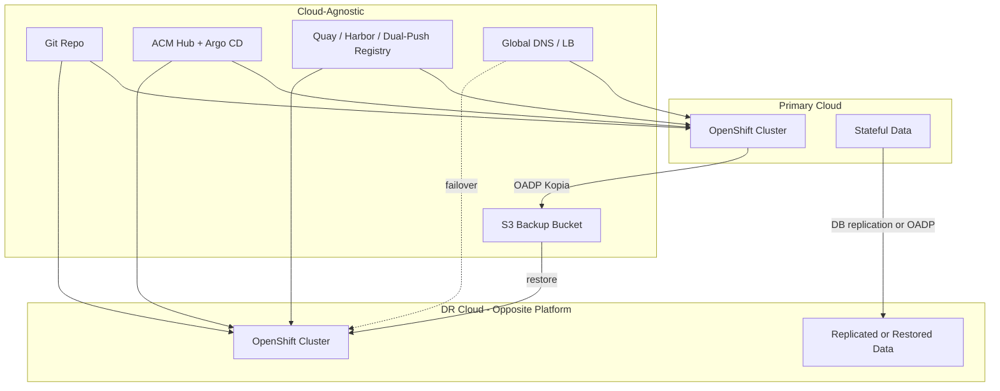

# Cross-Cloud Disaster Recovery — ARO ↔ ROSA HCP

**Executive Briefing — Multi-Cloud Business Continuity**

This guide extends the [ARO Multi-Region DR Strategy](../aro-disaster-recovery/README.md) to **cross-cloud** scenarios between Azure Red Hat OpenShift (ARO) and Red Hat OpenShift Service on AWS Hypershift (ROSA HCP).

> **Key platform fact:** ARO and ROSA HCP are **independent managed clusters** in different clouds. There is no stretched cluster, no shared control plane, and **Azure Disk CSI snapshots cannot attach to AWS EBS**. Cross-cloud DR relies on GitOps config sync, cloud-neutral backup (OADP Kopia → S3), database-native replication, and global traffic steering.

---

## Table of Contents

- [When to Use Cross-Cloud DR](#when-to-use-cross-cloud-dr)
- [Architecture Overview](#architecture-overview)
- [DR Tier Options](#dr-tier-options)
- [Layer-by-Layer Design](#layer-by-layer-design)
- [Implementation Phases](#implementation-phases)
- [Operational Runbooks](#operational-runbooks)
- [Readiness Checklist](#readiness-checklist)
- [References](#references)

---

## When to Use Cross-Cloud DR

| Driver | Example |
|--------|---------|
| Cloud provider outage insurance | Azure region down → fail over to ROSA on AWS |
| Regulatory multi-cloud mandate | No single-cloud dependency |
| M&A / dual-cloud estate | Existing ARO + ROSA footprint |
| Geo-distribution | Primary in Azure region, DR in AWS region with better latency to users |

Cross-cloud DR is **more complex and expensive** than same-cloud multi-region DR. Start with [Backup & Restore (Cold)](#dr-tier-options) and validate before investing in warmer tiers.

---

## Architecture Overview

### Sync Layers

| Layer | Mechanism | Repo Reference |
|-------|-----------|----------------|
| Configuration | GitOps + ACM ApplicationSets | [`shared-vpc/gitops/`](../../cluster-creation-cloud/aws/shared-vpc/gitops/) |
| Compute | Terraform IaC per cloud | [`cross-cloud-dr/environments/`](../../cluster-creation-cloud/cross-cloud-dr/environments/) |
| Container images | Quay, Harbor, or dual-push CI | [`identity-registry-setup.md`](../../operations/disaster-recovery/identity-registry-setup.md) |
| Persistent data | OADP Kopia + DB replication | [`oadp_cross_cloud_s3_guide.md`](../../operations/backup-restore/oadp_cross_cloud_s3_guide.md) |

### Shared Responsibility

Red Hat/Microsoft SRE own **control plane** (etcd, API server). You own application state, PVC data, Git config, secrets, traffic cutover, and failback.

---

## DR Tier Options

Run a [BIA workshop](../../operations/disaster-recovery/bia-workshop-template.md) first. Do not apply one tier platform-wide.

| Tier | RTO | RPO | Cross-Cloud Implementation |
|------|-----|-----|---------------------------|
| **Backup & Restore (Cold)** | 2–8 hrs | Hours | Terraform DR cluster on failover → GitOps sync → OADP restore → DNS cutover |
| **Pilot Light** | 30–90 min | 5–60 min | Minimal DR cluster always running; scale-up on failover |
| **Active/Passive** | 5–15 min | Seconds–minutes | Full DR cluster idle; continuous DB replication; traffic switch only |
| **Active/Active** | ~Seconds | ~Seconds | Both clouds serve traffic; global LB + multi-region writable DB |

### Primary → DR Direction

| Scenario | Primary | DR |
|----------|---------|-----|
| A | ARO (Azure) | ROSA HCP (AWS) |
| B | ROSA HCP (AWS) | ARO (Azure) |
| C | Both | Active/Active |

Use matching tfvars from [`cross-cloud-dr/environments/`](../../cluster-creation-cloud/cross-cloud-dr/environments/).

---

## Layer-by-Layer Design

### 1. Cluster Infrastructure

- Pin **same OpenShift minor version** on both clusters
- **Non-overlapping CIDRs** across clouds (see [`cross-cloud-dr/README.md`](../../cluster-creation-cloud/cross-cloud-dr/README.md))
- Pre-validate quota in DR cloud before go-live
- Private vs public ingress must match traffic steering design

### 2. GitOps & ACM

- Hub cluster must survive primary cloud outage — place on DR cloud or neutral cluster
- DR cluster must reconcile **before** disaster, not during failover
- See [ACM GitOps Setup](../../operations/disaster-recovery/acm-gitops-setup.md)

### 3. Identity

- Single **Entra ID tenant** for both clusters
- Register OAuth redirect URIs for **both** cluster domains upfront
- Break-glass creds in neutral vault

### 4. Networking

- No VNet↔VPC peering — use Site-to-Site VPN or ExpressRoute + Direct Connect for replication traffic
- Budget cross-cloud egress for DB replication and backup sync
- Mirror egress/firewall rules; include DR egress IPs in SaaS allowlists

### 5. Storage & Data

**Critical:** Use OADP **Kopia/datamover** for PVC backup — not CSI snapshots — when restoring across clouds.

Complete [Stateful Workload Inventory](../../operations/disaster-recovery/stateful-workload-inventory.md) before sign-off.

### 6. Container Registry

ACR geo-replication and ECR alone are **insufficient** for cross-cloud DR. Use Quay, Harbor replication, or dual-push CI.

### 7. Traffic Steering

| Visibility | Failover Mechanism |
|------------|-------------------|
| Public | Route 53, Cloudflare, Akamai, or Front Door with origins in both clouds |
| Private | Custom app domain + DNS repoint via hybrid DNS — rehearse in every drill |

See [Traffic Steering Guide](../../operations/disaster-recovery/traffic-steering-guide.md).

### 8. Backup (OADP)

S3 bucket accessible from both clouds with Object Lock/versioning. See [OADP Cross-Cloud S3 Guide](../../operations/backup-restore/oadp_cross_cloud_s3_guide.md).

---

## Implementation Phases

| Phase | Duration | Activities |
|-------|----------|------------|
| **0 — Discovery** | Week 1–2 | BIA workshop, stateful inventory, compliance review, region validation |
| **1 — Cold DR** | Week 3–6 | Provision DR cluster, ACM/GitOps, Entra ID, OADP S3, neutral registry, restore test |
| **2 — Traffic & Runbooks** | Week 7–8 | Global DNS/LB, failover/failback runbooks, neutral runbook storage |
| **3 — Warm DR** | Week 9–12 | Pilot Light or Active/Passive, DB replication, cross-cloud VPN |
| **4 — Validation** | Ongoing | Quarterly failover drill, annual failback drill, tabletop exercises |

---

## Operational Runbooks

| Runbook | Purpose |
|---------|---------|
| [DR Validation Guide](../../operations/disaster-recovery/dr-validation-guide.md) | Step-by-step testing with scripts |
| [Failover Runbook](../../operations/disaster-recovery/failover-runbook-aro-rosa.md) | Primary → DR cutover |
| [Failback Runbook](../../operations/disaster-recovery/failback-runbook-aro-rosa.md) | DR → primary restore |
| [DR Drill Checklist](../../operations/disaster-recovery/dr-drill-checklist.md) | Quarterly validation |
| [Data Replication Guide](../../operations/disaster-recovery/data-replication-guide.md) | Tier 1+ stateful apps |
| [Cross-Cloud Production Checklist](../aro-decision-matrix/cross-cloud-production-readiness-checklist.md) | Go-live gate |

---

## Readiness Checklist

Consolidated cross-cloud checklist. Full detail in [Cross-Cloud Production Readiness Checklist](../aro-decision-matrix/cross-cloud-production-readiness-checklist.md).

**Capacity**
- [ ] Both clouds support required OpenShift version and SKUs
- [ ] Quota reserved in DR cloud for full failover scale

**Networking**
- [ ] Non-overlapping CIDRs; cross-cloud VPN if replication required
- [ ] Global traffic manager with health probes; DNS TTL supports RTO

**Storage & Data**
- [ ] Stateful workload inventory complete
- [ ] OADP Kopia to S3 with immutability; quarterly restore tested
- [ ] Failback runbook rehearsed

**GitOps / CI/CD**
- [ ] Argo CD reconciling in DR cluster continuously
- [ ] CI pushes to cloud-neutral or dual registry
- [ ] Annual failover + failback drill completed

**Governance**
- [ ] BIA sign-off; disaster declaration authority documented
- [ ] Data residency verified for cross-cloud replication
- [ ] Runbooks accessible during regional outage

---

## References

### In This Repository

- [ARO Multi-Region DR](../aro-disaster-recovery/README.md)
- [Multi-Cloud GitOps](../../cluster-creation-cloud/aws/shared-vpc/gitops/README.md)
- [ARO Backup/Restore](../../docs/storage/aro_backup_restore.md)
- [OADP Demo Guide](../../operations/backup-restore/oadp_clean_guide.md)
- [Database Migration / ESO Lab](../../operations/database-migration/)

### External

- [Red Hat ARO DR Guidance](https://cloud.redhat.com/experts/aro/disaster-recovery/)
- [OADP Documentation](https://docs.openshift.com/container-platform/latest/backup_and_restore/application_backup_and_restore/oadp-intro.html)
- [Velero Documentation](https://velero.io/docs/main/)
- [RHACM](https://docs.redhat.com/en/documentation/red_hat_advanced_cluster_management_for_kubernetes/latest)
