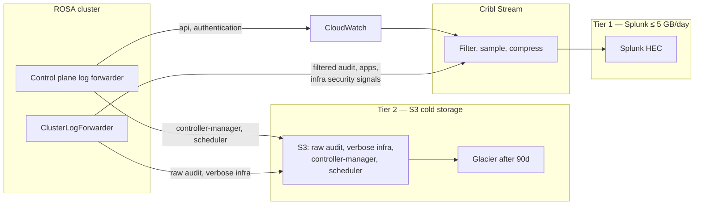

# ROSA Log Filtering and Routing for Splunk Cost Control

Step-by-step guide to implement tiered log routing on Red Hat OpenShift Service on AWS (ROSA) so you stay under a **5 GB/day Splunk ingestion cap** while preserving security-relevant telemetry.

This runbook implements the organizational **OpenShift and ROSA Logging Strategy for Security and Cost** — routing only security-critical streams to Splunk (Tier 1), verbose operational logs to Amazon S3 (Tier 2), and dropping or rate-limiting the rest (Tier 3).

## Problem statement

| Metric | Current state | Target |
|--------|---------------|--------|
| Daily Splunk volume | ~3.6–3.7 GB (95% infrastructure) | ≤ 5 GB/day hard cap |
| Headroom for apps | ~1.3 GB | ≥ 2 GB reserved for application logs |
| Cribl role | Write-on (passthrough) | Active filter + compression layer |
| Past incident | Runaway app logging → ~$4,000/mo cloud bill | Hard flow-control + tiered routing |

Infrastructure logs dominate volume on ROSA. Control plane components (API server, OAuth/authentication, controller-manager, scheduler) and node journald output are the primary drivers. The strategy **splits security-critical logs to Splunk (Tier 1)**, **routes verbose operational logs to Amazon S3 (Tier 2)**, and **drops or rate-limits the remainder (Tier 3)**.

---

## Log category reference

OpenShift categorizes logs differently depending on where they originate. Use this table to map components to the correct mechanism and tier.

> **Configuration note:** Data plane logs (application, infrastructure, audit from worker nodes) are managed via **ClusterLogForwarder**. Hosted control plane logs on ROSA HCP are managed via the **ROSA control plane log forwarder** (`rosa create log-forwarder`) to CloudWatch or S3. Integrate Splunk with the CloudWatch log groups designated for **API** and **Authentication** only; map Controller Manager and Scheduler groups to S3.

> **ROSA HCP note:** On Hosted Control Plane clusters, **kube API audit volume** primarily flows through the **control plane log forwarder** (Step 5) and **audit log forwarding** (Step 5.4), not worker-node CLF audit inputs. Data-plane CLF still captures node **auditd** and worker-collected audit files where present.

### Data plane (ClusterLogForwarder)

| Log category | Components | Why it matters | Tier | Mechanism |
|--------------|------------|----------------|------|-----------|
| **Audit** | Node auditd, kube/openshift API audit on workers | Chronological record of user/admin/component activity | **Tier 1** (filtered) + **Tier 2** (raw) | CLF: dual pipelines — filtered → Cribl/Splunk; unfiltered → S3 |
| **Infrastructure — nodes** | journald, kubelet | OS tampering, auth failures, runtime errors | **Tier 1** (security subset) + **Tier 2** (verbose) | CLF `infrastructure` source `node` → Cribl filter → Splunk; remainder → S3 |
| **Infrastructure — pods** | Pods in `openshift*`, `kube*`, `default` (ingress, CSI, OVN) | Ingress tampering, network policy drops, storage errors | **Tier 1** (errors) + **Tier 2** (info) | CLF `infrastructure` source `container` → split in Cribl by severity |
| **Application** | User workload containers | App-layer attacks, custom security events | **Tier 1** (selective) + **Tier 3** (rate-limited drops) | CLF namespace allow-list + `rateLimitPerContainer` |

### Control plane — ROSA HCP (control plane log forwarder)

| Log group | Components | Why it matters | Tier | Mechanism |
|-----------|------------|----------------|------|-----------|
| **api** | kube-apiserver, oauth-openshift, openshift-apiserver, audit-webhook, packageserver | Unauthorized access, API abuse, privilege escalation | **Tier 1** | Forwarder → CloudWatch → Cribl → Splunk |
| **authentication** | ignition-server, konnectivity-agent | Compromised credentials, brute force, bootstrap anomalies | **Tier 1** | Forwarder → CloudWatch → Cribl → Splunk |
| **controller-manager** | kube-controller-manager, cloud-credential-operator, cluster-network-operator, ingress-operator, ovnkube-control-plane | Config drift, attacker state manipulation | **Tier 2** | Forwarder → S3 |
| **scheduler** | kube-scheduler | Unexpected workload placement, resource exhaustion | **Tier 2** | Forwarder → S3 |
| **Uncategorized** | etcd, cluster-api, private-router, certified-operators-catalog | DR forensics (etcd); mostly noise (catalogs) | **Tier 2** / **Tier 3** | See [Step 5.1](#51-log-forwarder-groups-and-uncategorized-components) |

### Three-tier summary

| Tier | Destination | What goes here |
|------|-------------|----------------|
| **Tier 1** | Splunk (via Cribl) / CloudWatch | API, Authentication, **filtered** Audit, infra **security signals**, selective Application logs |
| **Tier 2** | Amazon S3 (+ Glacier after retention) | Controller Manager, Scheduler, **unfiltered** Audit firehose, verbose Infrastructure |
| **Tier 3** | Drop / omit | Excess Application noise (flow control), uncategorized catalog operators, debug/trace |

---

## Architecture overview



### Volume budget (example)

| Stream | Budget | Rationale |
|--------|--------|-----------|
| API + Authentication (CP) | 600 MB | Real-time threat detection |
| Audit — filtered (data plane) | 400 MB | Threat hunting subset |
| Infrastructure — security signals | 200 MB | SSH failures, kubelet errors, ingress errors |
| Application workloads | 2.0 GB | Reserved for security-critical apps |
| Buffer | 800 MB | Incident headroom |
| **Total Splunk** | **≤ 4.0 GB** | ~1 GB safety margin under 5 GB cap |
| Tier 2 (S3) | Unlimited* | Raw audit + verbose infra + CP ops logs |

\*S3 → Glacier transition keeps long-term compliance cost low.

---

## Prerequisites

### Install OpenShift Logging 6 on ROSA HCP (Day 0)

ROSA HCP clusters require **OpenShift Logging 6.x** (Loki Operator + Logging Operator + Cluster Observability Operator for console UI). Complete that install first:

- [Configuring OpenShift Logging 6 on ROSA HCP — Red Hat Cloud Experts](https://cloud.redhat.com/experts/o11y/openshift-logging6-rosa-hcp/)

That guide covers LokiStack (local S3-backed store for in-cluster troubleshooting), IAM for `logging-collector`, and optional CLF → CloudWatch. **Do not** forward all log types to CloudWatch or Splunk as shown in the RH examples — apply the tier routing in this guide as a Day 1 overlay.

Note: the Logging 6 stack requires **≥ 32 vCPUs** in the worker pool for LokiStack sizing.

> **Logging 6 API:** OpenShift Logging 6 uses **`observability.openshift.io/v1`** for `ClusterLogForwarder` (not `logging.openshift.io/v1`). Collectors run **Vector**. Each custom `inputs[]` and `filters[]` entry requires an explicit **`type`** field. Audit sources are **`kubeAPI`** and **`openshiftAPI`** (not `kube` / `openshift`). Use **`spec.serviceAccount.name`** (not `serviceAccountName`).

> **Day 0 warning:** The Red Hat Logging 6 install guide may include a CLF that forwards **all** log types to CloudWatch or Loki. **Remove or replace** that CLF before applying this guide — do not run both.

### Configuration variables

Export these once per cluster. Substitute into manifests under [`examples/`](examples/).

```bash
export CLUSTER_NAME=my-rosa-hcp
export AWS_ACCOUNT_ID=$(aws sts get-caller-identity --query Account --output text)
export AWS_REGION=us-east-1                    # must match ROSA cluster region
export LOG_BUCKET=rosa-logs-cold-${AWS_ACCOUNT_ID}

# OCM internal cluster ID (for CP log forwarders and audit log patch)
export OCM_CLUSTER_ID=$(rosa describe cluster -c "${CLUSTER_NAME}" -o json | jq -r .id)

# OIDC provider path (no https:// prefix) for IRSA trust policies
export OIDC_ENDPOINT_URL=$(rosa describe cluster -c "${CLUSTER_NAME}" -o json \
  | jq -r '.aws.sts.oidc_endpoint_url' | sed 's|https://||')

# Cribl HTTP Source or Splunk HEC endpoint reachable from cluster egress
export CRIBL_HEC_URL=https://cribl.example.com:10080/cribl/_hec
export CRIBL_TOKEN=your-cribl-or-splunk-hec-token
```

Confirm AWS CLI and `rosa`/`ocm` target the **same AWS account** that hosts the cluster:

```bash
aws sts get-caller-identity
rosa describe cluster -c "${CLUSTER_NAME}" | grep -E 'AWS Account|Region'
```

### IAM roles overview

Three distinct roles are required. Do not reuse one role for all purposes.

| Role | Trust principal | Used by |
|------|-----------------|---------|
| **`${CLUSTER_NAME}-logging-access`** | Cluster OIDC → `logging-collector`, `logging-loki` | CLF S3 output, LokiStack storage |
| **`CustomerLogDistribution-${CLUSTER_NAME}`** | Red Hat ROSA service (`590183771336`) + cluster external ID | `rosa create log-forwarder` → CloudWatch |
| **`${CLUSTER_NAME}-audit-log-cloudwatch`** | Cluster OIDC → `cloudwatch-audit-exporter` | OCM audit log forwarding (Step 5.4) |

### Day 1 requirements (this guide)

- ROSA HCP with **OpenShift Logging 6.x** and **Vector** collector (default in Logging 6).
- `cluster-admin` or delegated logging admin.
- AWS: S3 bucket(s) for Tier 2, IAM roles for CLF and ROSA control plane forwarder.
- Cribl Stream reachable from cluster egress.
- Splunk HEC endpoint and token.
- Tools: `oc`, `rosa`, `aws` CLI.

Verify:

```bash
oc get clusterversion
oc get clusterlogforwarder -n openshift-logging
oc get pods -n openshift-logging -l app.kubernetes.io/component=collector \
  -o jsonpath='{.items[0].spec.containers[*].name}{"\n"}'
# Expect: collector  (Vector-based collector in Logging 6)

oc api-resources | grep clusterlogforwarder
# Expect: observability.openshift.io/v1

oc get lokistack -n openshift-logging
# Expect: Ready (Day 0 complete)
```

Use service account **`logging-collector`** for CLF and **`logging-loki`** for LokiStack (matches Red Hat Logging 6 IRSA patterns).

---

## Step 1 — Implement tiered log routing

Tiered routing uses **multiple CLF pipelines** for data plane logs and **separate ROSA control plane forwarders** for HCP logs (Step 5).

### 1.1 Create AWS resources for Tier 2 (S3)

```bash
# us-east-1
if [ "${AWS_REGION}" = "us-east-1" ]; then
  aws s3api create-bucket --bucket "${LOG_BUCKET}" --region "${AWS_REGION}"
else
  aws s3api create-bucket --bucket "${LOG_BUCKET}" --region "${AWS_REGION}" \
    --create-bucket-configuration LocationConstraint="${AWS_REGION}"
fi

aws s3api put-bucket-lifecycle-configuration \
  --bucket "${LOG_BUCKET}" \
  --lifecycle-configuration '{
    "Rules": [
      {
        "ID": "audit-raw-retention",
        "Status": "Enabled",
        "Filter": {"Prefix": "audit/"},
        "Transitions": [
          {"Days": 30, "StorageClass": "STANDARD_IA"},
          {"Days": 90, "StorageClass": "GLACIER"}
        ],
        "Expiration": {"Days": 365}
      },
      {
        "ID": "infra-verbose-retention",
        "Status": "Enabled",
        "Filter": {"Prefix": "infrastructure/"},
        "Transitions": [
          {"Days": 30, "StorageClass": "STANDARD_IA"},
          {"Days": 90, "StorageClass": "GLACIER"}
        ],
        "Expiration": {"Days": 365}
      },
      {
        "ID": "control-plane-ops-retention",
        "Status": "Enabled",
        "Filter": {"Prefix": "control-plane/"},
        "Transitions": [
          {"Days": 30, "StorageClass": "STANDARD_IA"},
          {"Days": 90, "StorageClass": "GLACIER"}
        ],
        "Expiration": {"Days": 365}
      }
    ]
  }'
```

Adjust `Expiration` days to your compliance window (90 or 365 days).

#### IRSA role for CLF S3 + LokiStack

Create a role trusted by **`logging-collector`** and **`logging-loki`**:

```bash
LOGGING_ROLE="${CLUSTER_NAME}-logging-access"

cat > logging-trust.json <<EOF
{
  "Version": "2012-10-17",
  "Statement": [{
    "Effect": "Allow",
    "Principal": {
      "Federated": "arn:aws:iam::${AWS_ACCOUNT_ID}:oidc-provider/${OIDC_ENDPOINT_URL}"
    },
    "Action": "sts:AssumeRoleWithWebIdentity",
    "Condition": {
      "StringEquals": {
        "${OIDC_ENDPOINT_URL}:sub": [
          "system:serviceaccount:openshift-logging:logging-collector",
          "system:serviceaccount:openshift-logging:logging-loki"
        ]
      }
    }
  }]
}
EOF

cat > logging-s3-policy.json <<EOF
{
  "Version": "2012-10-17",
  "Statement": [{
    "Effect": "Allow",
    "Action": [
      "s3:ListBucket", "s3:PutObject", "s3:GetObject", "s3:DeleteObject"
    ],
    "Resource": [
      "arn:aws:s3:::${LOG_BUCKET}",
      "arn:aws:s3:::${LOG_BUCKET}/*"
    ]
  }]
}
EOF

aws iam create-role --role-name "${LOGGING_ROLE}" \
  --assume-role-policy-document file://logging-trust.json

aws iam create-policy --policy-name "${LOGGING_ROLE}-policy" \
  --policy-document file://logging-s3-policy.json

aws iam attach-role-policy --role-name "${LOGGING_ROLE}" \
  --policy-arn "arn:aws:iam::${AWS_ACCOUNT_ID}:policy/${LOGGING_ROLE}-policy"

export LOGGING_ROLE_ARN="arn:aws:iam::${AWS_ACCOUNT_ID}:role/${LOGGING_ROLE}"
```

Patch the LokiStack secret (Day 0) if `role_arn` is empty:

```bash
oc patch secret logging-loki-aws -n openshift-logging --type merge -p "{
  \"stringData\": {
    \"role_arn\": \"${LOGGING_ROLE_ARN}\",
    \"bucketnames\": \"${LOKI_BUCKET:-your-loki-bucket}\",
    \"region\": \"${AWS_REGION}\",
    \"endpoint\": \"https://s3.${AWS_REGION}.amazonaws.com\",
    \"audience\": \"sts.amazonaws.com\"
  }
}"

oc annotate sa logging-loki -n openshift-logging \
  eks.amazonaws.com/role-arn="${LOGGING_ROLE_ARN}" --overwrite
```

Replace `your-loki-bucket` with the bucket name configured during Day 0 LokiStack install.

### 1.2 Configure split routing in ClusterLogForwarder

Use the template [`examples/clusterlogforwarder-tiered.yaml`](examples/clusterlogforwarder-tiered.yaml) (OpenShift Logging 6 / `observability.openshift.io/v1`):

```yaml
apiVersion: observability.openshift.io/v1
kind: ClusterLogForwarder
metadata:
  name: instance
  namespace: openshift-logging
spec:
  managementState: Managed
  serviceAccount:
    name: logging-collector

  outputs:
    - name: cribl-hec
      type: http
      http:
        url: "https://cribl.example.com:10080/cribl/_hec"
        format: ndjson
        authentication:
          token:
            from: secret
            secret:
              name: cribl-hec-secret
              key: token
      rateLimit:
        maxRecordsPerSecond: 5000

    - name: s3-cold
      type: s3
      s3:
        bucket: rosa-logs-cold-ACCOUNT_ID
        region: us-east-1
        keyPrefix: '{.log_type||"none"}/'
        authentication:
          type: iamRole
          iamRole:
            roleARN:
              secretName: logging-s3-role
              key: role_arn
            token:
              from: serviceAccount

  inputs:
    - name: audit-all
      type: audit
      audit:
        sources: [kubeAPI, openshiftAPI]

    - name: infra-node
      type: infrastructure
      infrastructure:
        sources: [node]

    - name: infra-containers
      type: infrastructure
      infrastructure:
        sources: [container]
        tuning:
          container:
            rateLimitPerContainer:
              maxRecordsPerSecond: 50

    - name: apps-production
      type: application
      application:
        includes:
          - namespace: "prod-*"
          - namespace: "staging-*"
        excludes:
          - namespace: "openshift-*"
          - namespace: "kube-*"
          - namespace: "openshift-operator-lifecycle-manager"
          - namespace: "openshift-marketplace"
          - namespace: "openshift-catalogd"
        tuning:
          rateLimitPerContainer:
            maxRecordsPerSecond: 100
          maxMessageSize: 256Ki

  filters:
    - name: audit-security-policy
      type: kubeAPIAudit
      kubeAPIAudit:
        omitStages: [RequestReceived]
        omitResponseCodes: [404, 409, 422, 429]
        rules:
          - level: None
            users: ["system:oauth-server", "system:serviceaccount:openshift-authentication:*"]
            verbs: ["get", "list", "watch"]
            resources:
              - group: "oauth.openshift.io"
                resources: ["oauthaccesstokens", "oauthauthorizetokens"]
          - level: Metadata
            verbs: ["create", "update", "patch", "delete"]
            resources:
              - group: "rbac.authorization.k8s.io"
                resources: ["roles", "rolebindings", "clusterroles", "clusterrolebindings"]
              - group: "security.openshift.io"
                resources: ["*"]
          - level: Metadata

  pipelines:
    - name: tier1-audit-filtered
      inputRefs: [audit-all]
      filterRefs: [audit-security-policy]
      outputRefs: [cribl-hec]
    - name: tier2-audit-raw
      inputRefs: [audit-all]
      outputRefs: [s3-cold]
    - name: tier1-infra-node
      inputRefs: [infra-node]
      outputRefs: [cribl-hec]
    - name: tier1-infra-containers
      inputRefs: [infra-containers]
      outputRefs: [cribl-hec]
    - name: tier1-apps
      inputRefs: [apps-production]
      outputRefs: [cribl-hec]
```

Apply:

```bash
oc create secret generic cribl-hec-secret -n openshift-logging \
  --from-literal=token="${CRIBL_TOKEN}"

oc create secret generic logging-s3-role -n openshift-logging \
  --from-literal=role_arn="${LOGGING_ROLE_ARN}"

envsubst < examples/clusterlogforwarder-tiered.yaml | oc apply -f -
```

Verify CLF reconciles:

```bash
oc get clusterlogforwarder instance -n openshift-logging -o jsonpath='{range .status.conditions[*]}{.type}={.status}{"\n"}{end}'
```

> **Dual audit path:** `tier1-audit-filtered` sends the security subset to Splunk. `tier2-audit-raw` sends the **complete unfiltered stream** to S3 for compliance — satisfying the requirement to retain the full firehose without paying Splunk ingestion costs.
>
> **Infrastructure split:** Node and container infra logs go to Cribl first. Cribl pipelines (Step 6.3) pass only security-relevant events to Splunk and route verbose operational logs to S3. CLF alone cannot filter journald message content — Cribl performs that split.

> **Important:** Do not add a pipeline referencing built-in `infrastructure` without Cribl filtering on the Splunk path.

---

## Step 2 — Use OpenShift native filters (ClusterLogForwarder)

Logging 6 supports namespace include/exclude globs on `spec.inputs[].application`.

### 2.1 Namespaces to exclude from Splunk-bound pipelines

| Namespace pattern | Why exclude |
|-------------------|-------------|
| `openshift-operator-lifecycle-manager` | Catalog sync, CSV reconciliation |
| `openshift-marketplace` | Operator bundle pull logs |
| `openshift-catalogd` | File-based catalog gRPC chatter |
| `openshift-monitoring` | Scrape noise — use metrics instead |
| `openshift-logging` | Collector self-logging |
| `openshift-*` (platform) | Covered by control plane forwarder on HCP |

### 2.2 Opt-in labeling for application teams

```yaml
spec:
  inputs:
    - name: apps-allowlist
      type: application
      application:
        includes:
          - namespace: "team-a-*"
          - namespace: "team-b-*"
        excludes:
          - namespace: "openshift-*"
          - namespace: "kube-*"
        selector:
          matchLabels:
            logging.mcs.io/tier: "splunk"
```

```bash
oc label namespace team-a-payments logging.mcs.io/tier=splunk
```

### 2.3 Verify filtering

```bash
oc get clusterlogforwarder instance -n openshift-logging -o jsonpath='{.status}' | jq .

COLLECTOR=$(oc get pods -n openshift-logging -l app.kubernetes.io/name=instance \
  -o jsonpath='{.items[0].metadata.name}')
oc exec -n openshift-logging "${COLLECTOR}" -c collector -- \
  cat /etc/vector/vector.toml | head -200
```

---

## Step 3 — Configure API audit filters (OpenShift § 12.4.11)

Reference: [Log collection and forwarding § 12.4.11 — OCP 4.16](https://docs.redhat.com/en/documentation/openshift_container_platform/4.16/html/logging/log-collection-and-forwarding#overview-of-api-audit-filter_logging-log-collection-forwarding).

- Rules evaluated **top to bottom**; first match wins.
- `level: None` drops; `level: Metadata` strips bodies.
- Requires **Vector** collector.
- Filters what gets **forwarded** — the raw pipeline (Step 1.2) still captures everything to S3.

### 3.1 Reduce OAuth log bloat

Since OpenShift 4.17.2, OAuth logs are included in managed cluster audit streams. Filter aggressively on the Splunk path:

```yaml
filters:
  - name: oauth-trim
    type: kubeAPIAudit
    kubeAPIAudit:
      omitStages: [RequestReceived]
      omitResponseCodes: [404, 409, 422, 429]
      rules:
        - level: None
          users: ["system:oauth-server"]
          verbs: ["get", "list", "watch"]
          resources:
            - group: "oauth.openshift.io"
              resources: ["oauthaccesstokens", "oauthauthorizetokens", "useroauthaccesstokens"]
        - level: None
          userGroups: ["system:authenticated"]
          nonResourceURLs: ["/api*", "/version", "/healthz*", "/readyz*"]
        - level: Request
          verbs: ["create"]
          resources:
            - group: "oauth.openshift.io"
              resources: ["oauthauthorizetokens"]
        - level: Metadata
          verbs: ["create", "update", "patch", "delete"]
          resources:
            - group: "rbac.authorization.k8s.io"
              resources: ["*"]
            - group: "security.openshift.io"
              resources: ["*"]
        - level: Metadata
```

---

## Step 4 — Apply flow control for applications (Tier 3)

Prevent runaway logging by enforcing per-container rate limits. Excess records are **dropped**.

```yaml
spec:
  inputs:
    - name: apps-governed
      type: application
      application:
        includes:
          - namespace: "*"
        excludes:
          - namespace: "openshift-*"
          - namespace: "kube-*"
          - namespace: "openshift-operator-lifecycle-manager"
          - namespace: "openshift-marketplace"
          - namespace: "openshift-catalogd"
        tuning:
          rateLimitPerContainer:
            maxRecordsPerSecond: 50
          maxMessageSize: 128Ki
```

| Environment | `maxRecordsPerSecond` |
|-------------|----------------------|
| Production | 50–100 |
| Staging | 100–200 |
| Dev | 20–50 or exclude from Splunk entirely |

### 4.1 Exclude uncategorized operator catalogs (Tier 3 — drop)

Do not forward catalog operator logs unless a team has explicit compliance need:

- `certified-operators-catalog`, `community-operators-catalog` — **omit** from CLF
- `openshift-operator-lifecycle-manager`, `openshift-marketplace`, `openshift-catalogd` — **exclude** via namespace globs

Verify drops:

```bash
COLLECTOR=$(oc get pods -n openshift-logging -l app.kubernetes.io/name=instance \
  -o jsonpath='{.items[0].metadata.name}')
oc exec -n openshift-logging "${COLLECTOR}" -c collector -- \
  curl -sk https://localhost:24231/metrics | grep -E 'rate_limit|dropped'
```

---

## Step 5 — ROSA Hosted Control Plane (HCP) optimization

On ROSA HCP, control plane logs are forwarded by Red Hat's **control plane log forwarder** — not CLF. Reference: [Forwarding control plane logs — ROSA 4](https://docs.redhat.com/en/documentation/red_hat_openshift_service_on_aws/4/html/security_and_compliance/rosa-forwarding-control-plane-logs).

### 5.1 Log forwarder groups and uncategorized components

| Group / component | Components | Volume | Route |
|-------------------|------------|--------|-------|
| **api** | kube-apiserver, oauth-openshift, openshift-apiserver, audit-webhook, packageserver | Medium–high | **Tier 1** → CloudWatch → Cribl → Splunk |
| **authentication** | ignition-server, konnectivity-agent | Medium | **Tier 1** → CloudWatch → Cribl → Splunk |
| **controller-manager** | kube-controller-manager, cloud-credential-operator, ingress-operator, ovnkube-control-plane | Very high | **Tier 2** → S3 |
| **scheduler** | kube-scheduler | High | **Tier 2** → S3 |
| **cloud-controller-manager** | AWS cloud integration | Medium | **Tier 2** → S3 |
| **cluster-autoscaler** | Node scaling decisions | Low–medium | **Tier 2** → S3 |
| **ovn-kubernetes** | Networking control plane | High | **Tier 2** → S3 |
| **etcd** | Core datastore | Low (unless errors) | **Tier 2** → S3 — retain warnings/errors for DR forensics |
| **cluster-api** | Cluster provisioning | Low | **Tier 2** → S3 if forwarded; otherwise omit |
| **private-router** | Private ingress | Low | **Tier 3** — omit unless troubleshooting ingress |
| **certified-operators-catalog** | Operator catalog | High if enabled | **Tier 3** — do not forward |

### 5.2 Configure split forwarders

Control plane log forwarders require a **`CustomerLogDistribution-*`** IAM role (Red Hat managed assume-role). Create it before running `rosa create log-forwarder`.

```bash
CP_ROLE="CustomerLogDistribution-${CLUSTER_NAME}"
CLUSTER_EXTERNAL_ID=$(rosa describe cluster -c "${CLUSTER_NAME}" -o json | jq -r .external_id)
RH_ROSA_ACCOUNT=590183771336

cat > cp-logfwd-trust.json <<EOF
{
  "Version": "2012-10-17",
  "Statement": [{
    "Effect": "Allow",
    "Principal": {"AWS": "arn:aws:iam::${RH_ROSA_ACCOUNT}:root"},
    "Action": "sts:AssumeRole",
    "Condition": {
      "StringEquals": {
        "sts:ExternalId": "${CLUSTER_EXTERNAL_ID}"
      }
    }
  }]
}
EOF

cat > cp-logfwd-cw-policy.json <<EOF
{
  "Version": "2012-10-17",
  "Statement": [{
    "Effect": "Allow",
    "Action": [
      "logs:CreateLogGroup", "logs:CreateLogStream",
      "logs:DescribeLogGroups", "logs:DescribeLogStreams",
      "logs:PutLogEvents", "logs:PutRetentionPolicy"
    ],
    "Resource": "arn:aws:logs:${AWS_REGION}:${AWS_ACCOUNT_ID}:log-group:/rosa/*"
  }]
}
EOF

aws iam create-role --role-name "${CP_ROLE}" \
  --assume-role-policy-document file://cp-logfwd-trust.json

aws iam create-policy --policy-name "${CP_ROLE}-policy" \
  --policy-document file://cp-logfwd-cw-policy.json

aws iam attach-role-policy --role-name "${CP_ROLE}" \
  --policy-arn "arn:aws:iam::${AWS_ACCOUNT_ID}:policy/${CP_ROLE}-policy"

export CP_CW_ROLE_ARN="arn:aws:iam::${AWS_ACCOUNT_ID}:role/${CP_ROLE}"
```

Substitute `${AWS_ACCOUNT_ID}`, `${OCM_CLUSTER_ID}`, and `${CP_CW_ROLE_ARN}` in the templates under [`examples/`](examples/), then create forwarders:

**Tier 1 — security groups to CloudWatch** ([`cp-security-cw.yaml`](examples/cp-security-cw.yaml)):

```bash
rosa create log-forwarder -c "${CLUSTER_NAME}" \
  --log-fwd-config=examples/cp-security-cw.yaml -y
```

**Tier 2 — operational groups to S3** ([`cp-ops-s3.yaml`](examples/cp-ops-s3.yaml)):

```bash
rosa create log-forwarder -c "${CLUSTER_NAME}" \
  --log-fwd-config=examples/cp-ops-s3.yaml -y
```

**Tier 2 — etcd (optional, compliance only):**

```yaml
# append to cp-ops-s3.yaml or create a second forwarder
s3:
  s3_config_bucket_name: "rosa-logs-cold-${AWS_ACCOUNT_ID}"
  s3_config_bucket_prefix: "control-plane/etcd/"
  groups: [etcd]
```

Verify:

```bash
rosa list log-forwarders -c "${CLUSTER_NAME}"
```

Do **not** subscribe Tier 2 S3 groups to CloudWatch → Splunk pipelines.

### 5.3 CloudWatch → Cribl → Splunk (api + authentication only)

Point a CloudWatch Logs subscription filter or Kinesis Firehose at your Cribl CloudWatch/Firehose source. Use the log group from Step 5.2 (`/rosa/${OCM_CLUSTER_ID}/security`).

```bash
aws logs put-subscription-filter \
  --log-group-name "/rosa/${OCM_CLUSTER_ID}/security" \
  --filter-name "to-cribl" \
  --filter-pattern "" \
  --destination-arn "arn:aws:firehose:${AWS_REGION}:${AWS_ACCOUNT_ID}:deliverystream/cribl-cp-security"
```

In Cribl, configure the Firehose/CloudWatch source and route to your Splunk HEC destination (Step 6).

### 5.4 Enable audit log forwarding (CloudWatch)

Audit log forwarding uses a **separate** IRSA role trusted by **`cloudwatch-audit-exporter`** — not the CP log forwarder role. See [KCS 7002219](https://access.redhat.com/solutions/7002219).

```bash
AUDIT_ROLE="${CLUSTER_NAME}-audit-log-cloudwatch"

cat > audit-trust.json <<EOF
{
  "Version": "2012-10-17",
  "Statement": [{
    "Effect": "Allow",
    "Principal": {
      "Federated": "arn:aws:iam::${AWS_ACCOUNT_ID}:oidc-provider/${OIDC_ENDPOINT_URL}"
    },
    "Action": "sts:AssumeRoleWithWebIdentity",
    "Condition": {
      "StringEquals": {
        "${OIDC_ENDPOINT_URL}:sub": "system:serviceaccount:openshift-config-managed:cloudwatch-audit-exporter"
      }
    }
  }]
}
EOF

cat > audit-cw-policy.json <<'EOF'
{
  "Version": "2012-10-17",
  "Statement": [{
    "Effect": "Allow",
    "Action": [
      "logs:PutLogEvents", "logs:CreateLogGroup", "logs:PutRetentionPolicy",
      "logs:CreateLogStream", "logs:DescribeLogGroups", "logs:DescribeLogStreams"
    ],
    "Resource": "arn:aws:logs:*:*:*"
  }]
}
EOF

aws iam create-role --role-name "${AUDIT_ROLE}" \
  --assume-role-policy-document file://audit-trust.json

aws iam create-policy --policy-name "${AUDIT_ROLE}-policy" \
  --policy-document file://audit-cw-policy.json

aws iam attach-role-policy --role-name "${AUDIT_ROLE}" \
  --policy-arn "arn:aws:iam::${AWS_ACCOUNT_ID}:policy/${AUDIT_ROLE}-policy"

export AUDIT_ROLE_ARN="arn:aws:iam::${AWS_ACCOUNT_ID}:role/${AUDIT_ROLE}"

oc annotate sa cloudwatch-audit-exporter -n openshift-config-managed \
  eks.amazonaws.com/role-arn="${AUDIT_ROLE_ARN}" --overwrite

# OCM internal cluster ID (same as OCM_CLUSTER_ID above)
ocm patch "/api/clusters_mgmt/v1/clusters/${OCM_CLUSTER_ID}" <<EOF
{
  "aws": {
    "audit_log": {
      "role_arn": "${AUDIT_ROLE_ARN}"
    }
  }
}
EOF
```

Verify:

```bash
rosa describe cluster -c "${CLUSTER_NAME}" -o json | jq '.aws.audit_log'
oc get pods -n openshift-config-managed
# Expect: cloudwatch-audit-exporter pod Running
aws logs describe-log-groups --log-group-name-prefix "ocm-production" --region "${AWS_REGION}"
```

To disable: `rosa edit cluster -c "${CLUSTER_NAME}" --audit-log-arn ""`

---

## Step 6 — Cribl pre-processing

Cribl is the **cost gate** and performs splits CLF cannot (journald content filtering, infra severity routing).

### 6.1 Topology

Configure in **your** Cribl Stream instance using credentials from `${CRIBL_HEC_URL}` / `${CRIBL_TOKEN}`.

```
Sources:
  - HTTP (CLF → filtered audit, infra node/container, apps) — URL: ${CRIBL_HEC_URL}
  - CloudWatch / Firehose (HCP api + authentication from Step 5.3)

Routes (priority order):
  1. route-cp-security     → pipeline-splunk-security
  2. route-audit-filtered  → pipeline-splunk-security
  3. route-infra-security  → pipeline-infra-security → Splunk OR S3
  4. route-apps            → pipeline-splunk-apps
  5. route-infra-verbose   → pipeline-s3-archive
  6. default               → devnull   # fail closed

Destinations:
  - Splunk HEC (Tier 1, monitored)
  - S3 (Tier 2 — verbose infra, sampled/dropped events)
```

### 6.2 Pipeline: security audit and CP logs

```javascript
// Route: route-cp-security / route-audit-filtered
__logType == 'audit' || source.includes('api') || source.includes('authentication')
```

| Stage | Function | Purpose |
|-------|----------|---------|
| Filter | Drop OAuth token reads, probe GETs | Volume reduction |
| Filter | Keep RBAC/SCC writes, auth failures | Security retention |
| Compressor | gzip | Wire efficiency |
| Splunk HEC | index=`rosa_security` | Tier 1 |

### 6.3 Pipeline: infrastructure split routing

CLF sends all node/container infra to Cribl. This pipeline implements the **split** from the strategy doc:

```javascript
// Route: route-infra-security — PASS to Splunk
(
  __logType == 'infrastructure' && (
    // journald security signals
    match(_raw, /(?i)(authentication failure|Failed password|sshd|kubelet.*error|OOM|segfault)/)
    // infra pod errors
    || (match(_raw, /(?i)(error|fatal|denied|forbidden)/) && !match(_raw, /(?i)(level=info|info msg)/))
    // ingress / network security
    || match(_raw, /(?i)(nginx.*(denied|error)|networkpolicy|iptables.*DROP)/)
  )
)
```

```javascript
// Route: route-infra-verbose — PASS to S3 (not Splunk)
__logType == 'infrastructure' && !(/* security route matched above */)
```

**Pipeline `pipeline-infra-security`:** normalize → Splunk HEC (`index=rosa_infra_security`, ~200 MB/day budget).

**Pipeline `pipeline-s3-archive`:** compress → S3 destination (`s3://rosa-logs-cold-ACCOUNT_ID/infrastructure/verbose/`).

### 6.4 Pipeline: applications with hard cap

```javascript
// Tier 3 — drop debug/trace
level in ('debug', 'trace', 'DEBUG', 'TRACE')

// Sample info under pressure
level == 'info' && Math.random() > 0.5
```

Set Splunk HEC destination **Max Events/sec** to ~3000 cluster-wide.

### 6.5 Daily volume guard

| Alert | Threshold | Action |
|-------|-----------|--------|
| Daily volume | 4.5 GB (90%) | Notify platform team |
| Daily volume | 4.8 GB (96%) | Enable aggressive Cribl sampling |
| Event rate spike | 2× 7-day baseline | Investigate runaway container |

---

## Step 7 — Splunk alerting (Tier 1)

Configure these saved searches on Tier 1 indexes for real-time detection (per security strategy):

```spl
# Repeated unauthorized API access
index=rosa_security sourcetype=kube:audit:filtered responseStatus.code=403
| stats count by user.username, objectRef.resource, source
| where count > 10

# Authentication anomalies
index=rosa_security (sourcetype=kube:audit:filtered OR source=*authentication*)
(responseStatus.code=401 OR responseStatus.code=403 OR "authentication.openshift.io/decision"="error")
| stats count by user.username, source, _time span=5m
| where count > 5

# RBAC privilege escalation
index=rosa_security sourcetype=kube:audit:filtered objectRef.resource IN ("clusterrolebindings", "rolebindings", "clusterroles")
verb IN ("create", "update", "patch", "delete")
| table _time, user.username, objectRef.namespace, objectRef.name, verb

# SSH / node compromise signals
index=rosa_infra_security ("Failed password" OR "authentication failure" OR "Accepted publickey")
| stats count by host, _time span=1h
| where count > 3
```

---

## Step 8 — Verification and ongoing operations

### 8.1 Validate routing

See also **[examples/README.md — Validation](examples/README.md#validation--what-you-should-see)** for expected outcomes per phase.

```bash
oc get clusterlogforwarder instance -n openshift-logging -o yaml | grep -A2 'type: Ready'
rosa list log-forwarders -c "${CLUSTER_NAME}"

# Tier 2 — data plane logs in S3
aws s3 ls "s3://${LOG_BUCKET}/audit/" --recursive | tail
aws s3 ls "s3://${LOG_BUCKET}/infrastructure/" --recursive | tail
aws s3 ls "s3://${LOG_BUCKET}/control-plane/" --recursive | tail

# Tier 1 — Splunk volume by index (your index names)
index=rosa_security OR index=rosa_infra_security OR index=rosa_apps earliest=-24h
| stats sum(eval(len(_raw))) as bytes by index
| eval gb=round(bytes/1024/1024/1024, 2)
```

### 8.2 Daily checklist

- [ ] Splunk ingestion < 4.5 GB/day
- [ ] Cribl infra split routing passing security signals only to HEC
- [ ] Raw audit arriving in S3 (`audit/`) or CP audit in CloudWatch (Step 5.4)
- [ ] No CP ops groups (controller-manager, scheduler) subscribed to Splunk
- [ ] OAuth token reads absent from Splunk sample
- [ ] S3 lifecycle transitioning to Glacier at 90 days
- [ ] Catalog/OLM namespaces excluded from Splunk pipelines

### 8.3 Rollback

1. Raise `maxRecordsPerSecond` temporarily.
2. Disable Cribl sampling (not security drop filters).
3. Rehydrate from S3 via Cribl Replay for incident windows — do not re-enable full infra → Splunk.

---

## Troubleshooting

| Symptom | Likely cause | Fix |
|---------|--------------|-----|
| LokiStack pods `CrashLoopBackOff`, `role ARN is not set` | Empty `role_arn` in `logging-loki-aws` secret | Patch secret + annotate `logging-loki` SA (Step 1.1) |
| CLF validation: unsupported audit source `kube` | Logging 6 API | Use `kubeAPI`, `openshiftAPI`; add `type:` on inputs/filters |
| CLF validation: `serviceAccountName` unknown | Logging 6 API | Use `spec.serviceAccount.name` |
| S3 sink silent / AccessDenied | Wrong AWS account or missing IRSA | Confirm `aws sts get-caller-identity` matches cluster account; check `logging-s3-role` secret |
| Cribl HTTP DNS / connection errors | Bad `${CRIBL_HEC_URL}` or egress blocked | Verify URL from a debug pod; open SG/firewall to Cribl |
| `rosa list clusters` empty | Wrong OCM/AWS profile | Login: `ocm login` + `rosa login`; use cluster account credentials |
| CP forwarder fails IAM | Role name missing `CustomerLogDistribution` prefix | Rename role per Step 5.2 |
| Audit → S3 at 0 events on HCP | API audit not on workers | Enable Step 5 + 5.4; expect CP audit in CloudWatch |
| CloudWatch CLF drops `Upload too large` | Batch > 1 MB | Remove Day 0 all-logs CloudWatch CLF; use tiered routing only |

---

## Reference manifests index

| Artifact | Purpose |
|----------|---------|
| [`examples/clusterlogforwarder-tiered.yaml`](examples/clusterlogforwarder-tiered.yaml) | Logging 6 CLF — dual audit path, infra/apps → Cribl, raw → S3 |
| [`examples/cp-security-cw.yaml`](examples/cp-security-cw.yaml) | CP api/auth → CloudWatch |
| [`examples/cp-ops-s3.yaml`](examples/cp-ops-s3.yaml) | CP ops groups → S3 cold storage |
| [`examples/README.md`](examples/README.md) | Variable substitution and apply order |
| Cribl pipelines (Step 6) | journald/infra security → Splunk HEC; verbose → S3 |
| IAM roles (Prerequisites) | `logging-access`, `CustomerLogDistribution-*`, `audit-log-cloudwatch` |
| S3 lifecycle rules (Step 1.1) | Standard-IA at 30d, Glacier at 90d, expire at 365d |

---

## References

- [Configuring OpenShift Logging 6 on ROSA HCP — Red Hat Cloud Experts](https://cloud.redhat.com/experts/o11y/openshift-logging6-rosa-hcp/) — Day 0 install (Loki, CLF, COO)
- [OpenShift 4.16 — Log collection and forwarding (§ 12.4.11 API audit filter)](https://docs.redhat.com/en/documentation/openshift_container_platform/4.16/html/logging/log-collection-and-forwarding)
- [OpenShift 4.16 — Configuring the audit log policy](https://docs.redhat.com/en/documentation/openshift_container_platform/4.16/html/security_and_compliance/audit-log-policy-config)
- [ROSA 4 — Forwarding control plane logs](https://docs.redhat.com/en/documentation/red_hat_openshift_service_on_aws/4/html/security_and_compliance/rosa-forwarding-control-plane-logs)
- [Red Hat KCS 7002219 — CloudWatch audit log forwarding for ROSA HCP](https://access.redhat.com/solutions/7002219)
- [ClusterLogForwarder API reference (Logging 6 / observability.openshift.io/v1)](https://github.com/openshift/cluster-logging-operator/blob/master/docs/reference/operator/api_observability_v1.adoc)
- [Cribl Stream documentation](https://docs.cribl.io/stream/)
