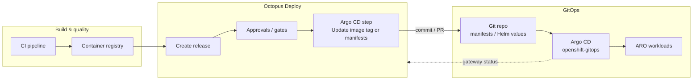
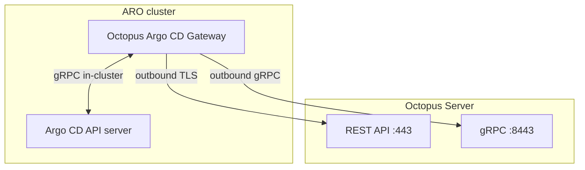

# Octopus Deploy + Argo CD on Azure Red Hat OpenShift (ARO)

A practical guide for teams transitioning to ARO and GitOps while keeping Octopus Deploy for release management, approvals, and enterprise delivery controls. Octopus does not replace Argo CD—it orchestrates **what** gets committed to Git; Argo CD remains the **GitOps engine** that reconciles cluster state on ARO.

**Audience:** Platform engineers, DevSecOps architects, and release managers running hybrid CD during an ARO migration.

---

## Table of contents

1. [Architecture overview](#1-architecture-overview)
2. [Step-by-step tutorial](#2-step-by-step-tutorial)
3. [Comparative analysis](#3-comparative-analysis)
4. [Reference material](#4-reference-material)

---

## 1. Architecture overview

### 1.1 Roles in the combined toolchain

| Component | Primary responsibility | Does *not* replace |
|-----------|------------------------|-------------------|
| **CI** (Azure DevOps, GitHub Actions, Jenkins, etc.) | Build, test, scan artifacts; push container images | Release promotion, environment modeling |
| **Octopus Deploy** | Release creation, approvals, orchestration, audit trail; commit manifest/image changes to Git | In-cluster reconciliation |
| **Git** (Azure Repos, GitHub, GitLab) | Source of truth for desired state | Runtime deployment |
| **Argo CD** (OpenShift GitOps on ARO) | Continuous sync, health assessment, drift detection, rollback via Git history | Enterprise release workflow |
| **ARO** | Managed OpenShift control plane, Routes, RBAC, operators | Application CD platform |

### 1.2 End-to-end workflow



**Typical promotion path**

1. CI builds `myapp:1.2.3` and pushes to a registry.
2. CI (or a feed trigger) creates an Octopus **release** with the new package version.
3. A human or automated gate approves deployment to **Staging**.
4. Octopus runs an **Update Argo CD Application Image Tags** or **Update Argo CD Application Manifests** step:
   - Clones the Git repo referenced by the Argo CD Application.
   - Updates image tags or renders Octostache templates with environment-specific variables.
   - Commits (or opens a PR) to the branch Argo CD watches (`targetRevision`).
5. Argo CD detects the Git change and **syncs** the Application to the ARO cluster.
6. Octopus waits for Application **Healthy** (optional verification step) and records the deployment in its audit log.
7. The same release is promoted to **Production** with a separate Octopus deployment to a production-scoped Argo CD Application.

### 1.3 Octopus Argo CD Gateway (control-plane bridge)

Octopus does not require a public Argo CD API endpoint. Instead, you install the **Octopus Argo CD Gateway** in the same cluster as Argo CD (typically alongside the OpenShift GitOps instance in `openshift-gitops` or a team namespace).



The gateway:

- Registers with Octopus using a one-time Helm-generated token.
- Streams Application health and sync status back to Octopus dashboards.
- Avoids exposing Argo CD to the internet—only **outbound** connectivity from ARO to Octopus is required.

**Outbound prerequisites from the cluster** (verify firewall / proxy rules on ARO):

| Destination | Protocol | Port |
|-------------|----------|------|
| Octopus Server REST | HTTPS | 443 |
| Octopus Server gRPC | gRPC (HTTP/2) | 8443 (default) |
| Argo CD API (in-cluster) | gRPC | Argo CD service port |

### 1.4 Mapping Applications to Octopus projects

Relationships are declared with **annotations** on Argo CD `Application` manifests—not by treating Argo CD as a classic Octopus deployment target.

```yaml
metadata:
  annotations:
    argo.octopus.com/project.<source-name>: my-octopus-project
    argo.octopus.com/environment.<source-name>: Staging
```

- `<source-name>` matches `spec.sources[].name` when using multiple sources; leave blank or use the default source name for single-source Applications.
- Octopus discovers Applications through the gateway and shows them in **Infrastructure → Argo CD Instances**.

See [`examples/argocd-application.yaml`](./examples/argocd-application.yaml) for a full ARO-ready sample.

### 1.5 What stays in Octopus vs what moves to GitOps

| Keep in Octopus during transition | Move to Git / Argo CD |
|-----------------------------------|------------------------|
| Environment promotion (Dev → Staging → Prod) | Deployment manifests, Helm values, Kustomize overlays |
| Manual approvals and change windows | Namespace-scoped workload definitions |
| Runbooks for non-Kubernetes systems (DB, SaaS, legacy VMs) | Sync policy, self-heal, prune settings |
| Centralized deployment audit and reporting | Application health at the Kubernetes layer |
| Coordinating multi-target releases (K8s + external) | Cluster drift correction |

Many customers run this **hybrid model for 12–24 months**: legacy Octopus targets for non-container workloads while new ARO services use Octopus → Git → Argo CD.

### 1.6 ARO-specific considerations

- **Operator install:** Use the **Red Hat OpenShift GitOps** operator from OperatorHub; a default cluster-scoped Argo CD instance is created in `openshift-gitops`.
- **Routes:** Enable an external Route on user-defined Argo CD instances when operators need the Argo CD UI (OpenShift GitOps CR: `server.route.enabled: true`).
- **Azure Repos / cross-tenant ADO:** If manifests live in Azure DevOps in a different Entra tenant, configure workload identity and repo credentials per Red Hat’s ARO + ADO guidance before Argo CD or Octopus can push/pull.
- **Self-signed TLS:** ARO/OpenShift GitOps often uses cluster-signed certificates; set `gateway.argocd.insecure="true"` on the gateway Helm chart if TLS verification fails during gateway install.
- **Network:** Ensure worker nodes can reach Octopus Server on **443 and 8443**; load balancers must support HTTP/2 for gRPC.

---

## 2. Step-by-step tutorial

This tutorial deploys a sample **hello-aro** application to ARO using:

- Git repo: `manifests/` (Kubernetes Deployment + Route)
- Argo CD Application in namespace `hello-aro`
- Octopus project: `hello-aro` with an image-tag update step

Estimated time: **2–4 hours** (excluding ARO cluster provisioning).

### 2.1 Prerequisites

| Item | Notes |
|------|-------|
| ARO cluster | `cluster-admin` or sufficient rights to install operators and create namespaces |
| `oc` / `kubectl` | Logged in to the ARO API |
| Octopus Deploy | Cloud or self-hosted; Space with permissions to create projects and Argo CD instances |
| Git repository | Azure Repos, GitHub, or GitLab—for manifests and Argo CD Application CR |
| Container registry | ACR, Quay, or other—images pulled by ARO |
| Helm 3 | For gateway install |

### 2.2 Install OpenShift GitOps (Argo CD) on ARO

1. In the OpenShift console: **Operators → OperatorHub → Red Hat OpenShift GitOps → Install**.
2. Confirm the default Argo CD instance in `openshift-gitops` (or create a user-defined instance per team namespace).

```bash
# Verify operator and default instance
oc get subscription -n openshift-operators | grep gitops
oc get argocd -n openshift-gitops
oc get pods -n openshift-gitops
```

3. (Optional) Create a **user-defined** Argo CD instance for application teams:

```bash
oc create namespace hello-aro
# Apply examples/argocd-instance.yaml after customizing
oc apply -f examples/argocd-instance.yaml
```

4. Retrieve the Argo CD admin password (default instance example):

```bash
oc -n openshift-gitops get secret openshift-gitops-cluster \
  -o jsonpath='{.data.admin\.password}' | base64 -d && echo
```

5. Install the `argocd` CLI (optional but useful for token generation):

```bash
# macOS example
brew install argocd
argocd login <argocd-route-host> --username admin --password '<password>'
argocd account generate-token
```

Save the JWT for gateway registration.

### 2.3 Prepare the Git repository

Layout (included under `examples/` in this demo):

```
manifests/
  base/
    deployment.yaml      # image: registry.example.com/hello-aro:1.0.0
    service.yaml
    route.yaml
argocd/
  hello-aro-application.yaml   # Argo CD Application + Octopus annotations
```

1. Push `examples/manifests/` and `examples/argocd-application.yaml` to your Git repo.
2. Register the repo in Argo CD (UI: **Settings → Repositories**, or declarative secret).

For **Azure DevOps in another tenant**, complete federated identity setup before this step.

### 2.4 Deploy the Argo CD Application on ARO

```bash
export GIT_REPO_URL='https://github.com/your-org/hello-aro-gitops.git'
export TARGET_NAMESPACE='hello-aro'

oc create namespace "${TARGET_NAMESPACE}" --dry-run=client -o yaml | oc apply -f -

# Edit repo URL in the Application manifest, then:
oc apply -f examples/argocd-application.yaml -n "${TARGET_NAMESPACE}"
```

Verify in Argo CD UI: Application `hello-aro` should appear (may be `OutOfSync` until first sync).

```bash
oc -n openshift-gitops get applications.argoproj.io -A | grep hello-aro
```

### 2.5 Connect Octopus to Argo CD (gateway install)

1. Octopus UI: **Infrastructure → Argo CD Instances → Add Argo CD Instance**.
2. Name: `aro-prod-gitops` (unique per cluster).
3. Environments: select environments this instance serves (e.g. Staging, Production).
4. Argo CD API URL: default in-cluster URL (wizard pre-fills `https://openshift-gitops-server.openshift-gitops.svc.cluster.local`).
5. Paste the Argo CD JWT token from step 2.2.
6. Copy the generated **Helm install** command and run it from a machine with `kubectl` context pointed at ARO:

```bash
helm install octo-argo-gateway oci://registry-1.docker.io/octopusdeploy/octopus-argocd-gateway-chart \
  --namespace octo-argo-gateway --create-namespace \
  --set registration.octopus.serverApiUrl="https://your-octopus.example.com" \
  --set registration.octopus.serverAccessToken="<one-hour-registration-token>" \
  --set gateway.argocd.serverGrpcUrl="openshift-gitops-server.openshift-gitops.svc.cluster.local:443" \
  --set gateway.argocd.authenticationToken="<argocd-jwt>" \
  --set gateway.argocd.insecure="true"
```

7. Wait for the wizard health check to pass. The instance appears under **Infrastructure → Argo CD Instances** with discovered Applications.

### 2.6 Configure Git credentials in Octopus

Octopus must clone and push to the same repos referenced by Argo CD Applications.

1. **Library → Git Credentials → Add Git Credential** (PAT, app password, or SSH).
2. Restrict credentials to the manifest repository URL.
3. Confirm no outstanding credential warnings in **Infrastructure → Argo CD Instances → Applications** view.

### 2.7 Create the Octopus project and deployment process

1. **Projects → Add Project** → name: `hello-aro`.
2. **Deployment Process → Add step** → category **Argo CD**:
   - **Update Argo CD Application Image Tags** (simplest for image-only promotions).

**Step configuration:**

| Setting | Value |
|---------|-------|
| Package / container image | `hello-aro` from your container feed |
| Feed | Docker/OCIR feed pointing to ACR/Quay |
| Commit message | `chore(hello-aro): release #{Octopus.Release.Number} → #{Octopus.Action.Package[hello-aro].PackageVersion}` |
| Verification | Wait for Argo CD Application Healthy |
| Sync mode | Per environment (recommended) |

3. **Lifecycles:** Dev → Staging → Production with optional manual approvals on Staging/Prod.
4. **Variables:** optional environment-scoped variables for manifest templates if you use the **Update Manifests** step instead.

**Alternative: Update Argo CD Application Manifests**

Use when you need full manifest control (replicas, env vars, ConfigMaps) via Octostache templates. See [`examples/templates/deployment.octopus.yaml`](./examples/templates/deployment.octopus.yaml).

### 2.8 Wire CI to Octopus releases

Example: CI builds and pushes `myregistry.azurecr.io/hello-aro:1.2.3`, then creates an Octopus release.

```bash
# Using Octopus CLI (illustrative)
octopus release create \
  --project "hello-aro" \
  --version "1.2.3" \
  --packageVersion "hello-aro:1.2.3"
```

Or configure an **External Feed Trigger** in Octopus to create releases when new tags appear in ACR.

### 2.9 Execute a full deployment

1. **Releases → Create release** (version `1.2.3`).
2. **Deploy to Staging** → approve if required.
3. Watch Octopus task log:
   - **Update Argo CD Application Image Tags** — clones repo, bumps `image:` tag in `manifests/base/deployment.yaml`, pushes commit.
   - **Trigger Argo CD application sync** — requests sync for the mapped Application.
   - **Wait for Argo CD Application Health** — polls until `Healthy`.
4. Confirm on ARO:

```bash
oc -n hello-aro get deploy,pods,route
oc -n hello-aro describe deployment hello-aro | grep Image
```

5. **Promote** the same release to Production (different Octopus environment → different `argo.octopus.com/environment.*` annotation scope).

### 2.10 Rollback

| Approach | Mechanism |
|----------|-----------|
| Octopus redeploy previous release | Re-commits prior image tag / manifest to Git; Argo CD syncs |
| Git revert | Revert commit on `targetRevision` branch; Argo CD self-heals |
| Argo CD UI / CLI | `argocd app rollback hello-aro` — use for emergency ops; Octopus audit may be out of date unless coordinated |

Preferred for audit consistency: **redeploy the last known good Octopus release**.

### 2.11 Validation checklist

- [ ] Gateway pod running: `oc -n octo-argo-gateway get pods`
- [ ] Application mapped in Octopus with correct project/environment
- [ ] Git commit appears after deployment with expected tag
- [ ] Argo CD sync status `Synced` / health `Healthy`
- [ ] Route responds with new version
- [ ] Octopus deployment timeline shows green verification step

---

## 3. Comparative analysis

| Feature / capability | Octopus + Argo CD | Argo CD alone |
|----------------------|-------------------|---------------|
| **GitOps sync to cluster** | Argo CD (unchanged) | Argo CD |
| **Environment promotion model** | Octopus lifecycle across Dev/Staging/Prod | Manual Git branches, PRs, or ApplicationSets |
| **Human approvals before prod** | Native Octopus approvals and gates | Git PR reviews, Argo CD sync windows, or third-party |
| **Audit trail (who deployed what, when)** | Octopus deployment history + Git commits | Git history + Argo CD UI events (less release-centric) |
| **Multi-cluster / multi-app orchestration** | Single Octopus release can coordinate many Applications | Per-Application sync; orchestration is custom |
| **Non-Kubernetes deployments** | Octopus runbooks (DB, APIs, VMs) in same release | Not applicable—needs separate tooling |
| **Container image promotion** | Built-in image tag step + feed triggers | Update values/YAML via CI or Image Updater |
| **Manifest templating** | Octostache variables per environment | Helm/Kustomize overlays, ApplicationSets |
| **Drift detection / self-heal** | Argo CD | Argo CD |
| **Dashboard for app health** | Argo CD UI + Octopus Argo CD views | Argo CD UI |
| **RBAC model** | Octopus spaces/roles + OpenShift RBAC + Argo CD RBAC | OpenShift RBAC + Argo CD RBAC |
| **Network security** | Outbound-only gateway from ARO | In-cluster; optional private Argo CD |
| **Learning curve** | Two products, clear split of duties | One GitOps tool, more custom automation |
| **License / cost** | Octopus + OpenShift GitOps (included in ARO support) | OpenShift GitOps |
| **Ideal when** | Enterprise change control, hybrid workloads, Octopus already entrenched | Cloud-native teams, strong Git/PR culture, minimal release tooling |

**Summary**

- **Octopus + Argo CD** fits regulated enterprises, phased ARO migrations, and teams that need one **release record** spanning Kubernetes and non-Kubernetes targets.
- **Argo CD alone** fits teams willing to encode promotion and governance in Git (trunk-based branches, PR policies, OPA, sync windows) and who do not need Octopus-style release orchestration.

---

## 4. Reference material

### Octopus Deploy — Argo CD integration

- [Argo CD deployments with Octopus (overview)](https://octopus.com/docs/argo-cd)
- [Argo CD instances and gateway install](https://octopus.com/docs/argo-cd/instances)
- [Scoping annotations (project / environment mapping)](https://octopus.com/docs/argo-cd/annotations)
- [Argo CD deployment steps (overview)](https://octopus.com/docs/argo-cd/steps)
- [Update Argo CD Application Image Tags](https://octopus.com/docs/argo-cd/steps/update-application-image-tags)
- [Update Argo CD Application Manifests](https://octopus.com/docs/argo-cd/steps/update-application-manifests)
- [Troubleshooting Argo CD in Octopus](https://octopus.com/docs/argo-cd/troubleshooting)
- [Git credentials in Octopus](https://octopus.com/docs/infrastructure/git-credentials)
- [Octopus blog: GitOps with Octopus and Argo CD](https://octopus.com/blog/argocd-and-octopus)
- [Octopus blog: Introducing Argo CD in Octopus](https://octopus.com/blog/argo-cd-in-octopus)
- [Octopus blog: Releases and rollbacks with Argo CD](https://octopus.com/blog/manage-releases-rollbacks-argo-cd)
- [Integration catalog: Update Argo CD Application Manifests](https://octopus.com/integrations/kubernetes/update-argo-cd-application-manifests)

### Octopus gateway Helm chart

- [Docker Hub: octopus-argocd-gateway-chart](https://hub.docker.com/r/octopusdeploy/octopus-argocd-gateway-chart)
- [GitHub: OctopusDeploy/helm-charts](https://github.com/OctopusDeploy/helm-charts)

### Argo CD

- [Argo CD documentation (stable)](https://argo-cd.readthedocs.io/en/stable/)
- [Application sources](https://argo-cd.readthedocs.io/en/stable/user-guide/application_sources/)
- [Declarative setup](https://argo-cd.readthedocs.io/en/stable/operator-manual/declarative-setup/)
- [Sync options](https://argo-cd.readthedocs.io/en/stable/user-guide/sync-options/)
- [GitHub: argoproj/argo-cd](https://github.com/argoproj/argo-cd)

### Azure Red Hat OpenShift (ARO)

- [Microsoft Learn: Azure Red Hat OpenShift documentation](https://learn.microsoft.com/en-us/azure/openshift/)
- [Create an ARO cluster](https://learn.microsoft.com/en-us/azure/openshift/create-cluster)
- [Tutorial: Create an ARO cluster](https://learn.microsoft.com/en-us/azure/openshift/tutorial-create-cluster)
- [Red Hat OpenShift on Azure welcome (docs.openshift.com)](https://docs.openshift.com/aro/welcome/index.html)

### Red Hat OpenShift GitOps (Argo CD on OpenShift)

- [Installing GitOps (docs.redhat.com)](https://docs.redhat.com/en/documentation/red_hat_openshift_gitops/1.18/html-single/installing_gitops/index)
- [Setting up an Argo CD instance](https://docs.redhat.com/en/documentation/red_hat_openshift_gitops/1.20/html/argo_cd_instance/setting-up-argocd-instance)
- [Installing the OpenShift GitOps operator (docs.openshift.com)](https://docs.openshift.com/gitops/latest/installing_gitops/installing-openshift-gitops-operator.html)
- [GitHub: redhat-developer/gitops-operator](https://github.com/redhat-developer/gitops-operator)

### ARO + Azure DevOps / cross-tenant Git

- [Configuring cross-tenant Azure DevOps access from Argo CD on ARO (Red Hat Cloud Experts)](https://cloud.redhat.com/experts/misc/cross-tenant-access-argocd-ado/)

### Related demo in this repository

- [Deploying GitOps on ROSA or ARO](../deploying-gitops-on-rosa-or-aro/) — Terraform-based cluster + GitOps bootstrap

---

## Files in this demo

| Path | Purpose |
|------|---------|
| [`examples/argocd-application.yaml`](./examples/argocd-application.yaml) | Argo CD Application with Octopus annotations |
| [`examples/argocd-instance.yaml`](./examples/argocd-instance.yaml) | Optional user-defined Argo CD instance CR |
| [`examples/manifests/base/deployment.yaml`](./examples/manifests/base/deployment.yaml) | Sample Deployment (image tag updated by Octopus) |
| [`examples/manifests/base/service.yaml`](./examples/manifests/base/service.yaml) | ClusterIP Service |
| [`examples/manifests/base/route.yaml`](./examples/manifests/base/route.yaml) | OpenShift Route |
| [`examples/templates/deployment.octopus.yaml`](./examples/templates/deployment.octopus.yaml) | Octostache template for manifest update step |

---

## Cleanup

```bash
oc delete application hello-aro -n hello-aro --ignore-not-found
oc delete namespace hello-aro --ignore-not-found
helm uninstall octo-argo-gateway -n octo-argo-gateway
oc delete namespace octo-argo-gateway --ignore-not-found
```

Remove the Argo CD instance from Octopus UI under **Infrastructure → Argo CD Instances**.
